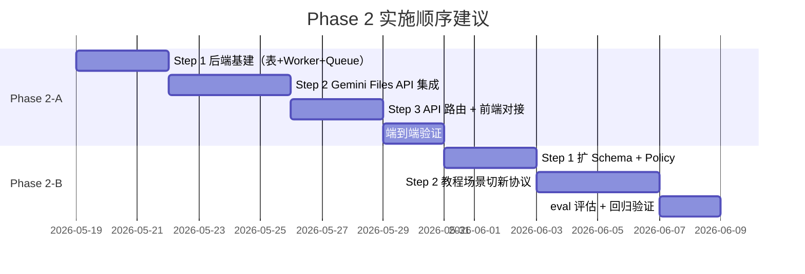

# Phase 2 优先级评估：A vs B 谁先开始？

> 评估维度：技术依赖 · 代码耦合 · 风险暴露 · 用户价值 · 实施复杂度

---

## 结论：建议 **先做 Phase 2-A**（视频分析任务化）

尽管架构评审文档（`Phase 2_architecture_review_suggestions.md` §四）建议"先 B 后 A"（协议先行），但结合当前代码实际状态和项目阶段，我的建议是 **先做 A，再做 B**。

理由如下：

---

## 一、技术依赖分析

### Phase 2-A 对 Phase 2-B 的依赖：**无**

Phase 2-A 的核心路径是：

```
前端上传视频 → POST /api/v2/analysis/jobs → Worker 处理 → Gemini Files API → 报告 → 前端轮询
```

这条链路**完全独立**于现有的意图识别系统：
- 新增独立的 `analysis_jobs` 表（不修改现有表）
- 新增独立的 API 路由（`/api/v2/analysis/jobs`）
- 新增独立的 Worker（`server/jobs/analysisWorker.ts`）
- 前端的视频上传入口（`ChatScreen.tsx` 的 `handleFileUpload`）直接走文件上传，**不经过 `classifyIntent()`**

> [!IMPORTANT]
> Phase 2-A 的视频分析流程由前端的"选择视频/拍摄视频"按钮触发，走的是 `multipart/form-data` 上传而非文本消息。它完全绕过 `intentRouter.ts`，不需要意图识别层的任何改动。

### Phase 2-B 对 Phase 2-A 的依赖：**弱依赖（可后行）**

Phase 2-B 在 `IntentDecision` 中定义了 `domain_intent = VIDEO_ANALYSIS`，但这只是为了处理文本场景（用户说"帮我分析视频"但没上传文件）。这个场景属于 B 的 Step 3/4 范围，不在首期（Step 1-2）的实施范围内。

```mermaid
graph LR
    A[Phase 2-A<br>视频分析任务化] -->|完全独立| DB[(analysis_jobs 表)]
    A -->|新增| API[/api/v2/analysis/jobs]
    A -->|新增| W[analysisWorker]
    A -->|修改| CS[ChatScreen.tsx<br>handleFileUpload]
    
    B[Phase 2-B<br>意图识别重构] -->|修改| IR[intentRouter.ts]
    B -->|修改| HCE[handleChatEvent.ts]
    B -->|修改| TV[templateValidator.ts]
    B -->|修改| APP[App.tsx<br>handleSendMessage]
    
    A -.->|"无依赖"| B
    B -.->|"弱依赖（VIDEO_ANALYSIS 场景）"| A
```

**结论：A 和 B 之间无阻塞性依赖。A 可以独立启动。**

---

## 二、代码耦合度与改动风险

### Phase 2-A 改动范围：**新增为主，低耦合**

| 文件 | 操作 | 与现有代码的耦合 |
|------|------|-----------------|
| `server/db.ts` | 修改 | 仅追加建表语句，不动现有表 |
| `server/jobs/queue.ts` | **新建** | 无耦合 |
| `server/jobs/analysisWorker.ts` | **新建** | 无耦合 |
| `server/orchestrator/handleAnalysisJob.ts` | **新建** | 仅调用现有 `recommendTutorials()` |
| `server/routes/v2.ts` | 修改 | 追加 2 个路由，不改现有路由 |
| `server/index.ts` | 修改 | 追加 2 行启动代码 |
| `client/geminiService.ts` | 修改 | 追加 2 个 API 函数 |
| `client/components/ChatScreen.tsx` | 修改 | 替换 `handleFileUpload` 内的 mock 逻辑 |

> **6 个新建 + 追加操作，2 个替换操作**。风险集中在 `ChatScreen.tsx` 的 `handleFileUpload` 替换，但这本身就是替换 mock 代码，不会破坏其他交互。

### Phase 2-B 改动范围：**修改为主，高耦合**

| 文件 | 操作 | 与现有代码的耦合 |
|------|------|-----------------|
| `server/intent/types.ts` | **新建** | 需从 `intentRouter.ts` 迁移类型 |
| `server/intent/policy.ts` | **新建** | 与 `intentRouter.ts` 强关联 |
| `server/intent/intentRouter.ts` | **大改** | 核心逻辑重构（规则层 + LLM prompt + fallback） |
| `server/orchestrator/handleChatEvent.ts` | **中改** | 教程判断 + prompt 选择 + 响应结构 |
| `server/orchestrator/templateValidator.ts` | 修改 | 新增 responseMode 分支 |
| `client/geminiService.ts` | 修改 | 接口字段扩展 |
| `client/App.tsx` | **中改** | 渲染分支逻辑重构 |

> **2 个新建，5 个修改（其中 2 个是大/中改）**。`intentRouter.ts` 和 `handleChatEvent.ts` 是当前系统的核心链路，改动这两个文件影响所有文本对话场景。

**结论：A 的改动以"新增"为主，对现有系统的破坏风险远低于 B。**

---

## 三、风险暴露面

### Phase 2-A 的主要风险：**外部依赖（Gemini API）**

- Gemini Files API 上传/处理稳定性
- 多模态模型的 JSON 输出稳定性
- Pass 1 时间戳准确性
- 视频文件 MIME 兼容性

这些风险**越早暴露越好**。Gemini Files API 是产品核心能力的基础设施，如果 API 有问题，越早发现越有时间调整方案。

### Phase 2-B 的主要风险：**系统稳定性回归**

- 新旧 intent 并存导致编排分裂
- LLM prompt 变化导致全局对话质量波动
- `response_mode` 被 LLM 漂移影响
- `templateValidator` 与新模式冲突
- 前端渲染逻辑变更影响所有消息类型

这些风险属于**系统性风险**，一旦引入会影响所有现有功能。需要更充分的 eval 覆盖和更谨慎的灰度策略。

> [!WARNING]
> Phase 2-B 修改的是**热链路**（每条用户消息都经过 `intentRouter → handleChatEvent → App.tsx`）。相比之下，Phase 2-A 修改的是**冷链路**（仅视频上传场景触发）。先做 A 可以避免在核心链路不稳定的情况下引入更多变量。

---

## 四、用户价值与交付可见度

### Phase 2-A：**从 0 到 1 的核心能力上线**

- 当前视频分析是完全 mock 的（`setTimeout` + 硬编码报告）
- A 完成后，用户第一次能看到**基于真实视频内容的 AI 分析报告**
- 这是产品最核心的卖点，也是最直观的用户价值
- 用户感知：**"哇，真的能分析我的视频了"**

### Phase 2-B：**从 60 分到 80 分的体验优化**

- 解决"问教程却输出长篇讲解"等体验问题
- 提升意图识别准确率和响应匹配度
- 用户感知：**"回答更精准了，不再答非所问了"**

> [!TIP]
> 从产品视角，A 是 **"有 vs 没有"** 的问题，B 是 **"好 vs 更好"** 的问题。先解决"有没有"，再优化"好不好"。

---

## 五、为什么不完全认同"协议先行"的建议？

架构评审文档建议"先 B 后 A"的理由是：

> *"让后端有稳定的新请求理解协议"*

这个理由在**大团队多人协作**场景下是合理的——先定协议，再并行开发功能。

但对当前项目（小规模、单人/极少人开发）：

| 考量 | "先 B 后 A" | "先 A 后 B" |
|------|------------|------------|
| A 是否依赖 B 的协议？ | ❌ 不依赖。A 的视频上传不走 intent 路由 | — |
| B 的协议定义是否影响 A 的实现？ | ❌ `IntentDecision` 中的 `VIDEO_ANALYSIS` 仅用于文本场景 | — |
| 先做 B 是否能加速 A？ | ❌ 无加速效果 | — |
| 先做 A 是否影响 B？ | ❌ A 不修改 intent 相关代码 | — |
| 哪个先验证外部 API 风险？ | B 不涉及新外部 API | ✅ A 先验证 Gemini Files API |
| 哪个对现有功能影响更小？ | B 改动热链路 | ✅ A 改动冷链路 |

**结论：在 A 不依赖 B 协议的前提下，"协议先行"的价值不成立。反而应该先做风险更可控、价值更直观的 A。**

---

## 六、推荐的实施顺序



### 阶段一：Phase 2-A（约 2 周）
1. 后端基建：`analysis_jobs` 表、Worker、Queue
2. Gemini Files API 集成：Two-Pass Pipeline、prompt、校验
3. 前端对接：替换 mock、轮询、报告渲染
4. 端到端验证

### 阶段二：Phase 2-B Step 1-2（约 1.5 周）
1. 扩 Schema：`IntentDecision` 类型、Adapter
2. Policy 层 + Fallback 重做
3. 教程场景切新协议：`RESOURCE_ONLY` / `TEXT_WITH_RESOURCES`
4. 前端 `TutorialListCard` + `response_mode` 渲染
5. eval 评估集 + 回归验证

### 阶段三：Phase 2-B Step 3-4（后续迭代）
- 器材对比、器材推荐、动作诊断、训练计划等

---

## 七、已确认事项 (Resolved)

> [!NOTE]
> **2026-05-16 确认结果**：
> 1. **Gemini SDK 版本**：已验证服务器安装的 `@google/genai` v1.43.0 完美支持 `ai.files.upload()` API。
> 2. **部署环境**：确认 MVP 阶段视频文件存本地磁盘 `server/uploads/` 是可接受的（需确保该目录在 `.gitignore` 中）。
> 3. **视频时长限制**：接受 ≤ 120 秒的 MVP 限制。
