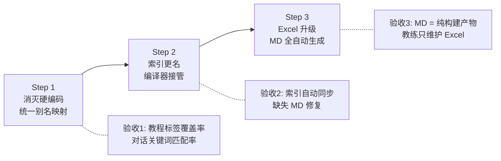

# Phase 3：知识库编译器与 SSOT 架构重构 — 实施计划

> 设计文档：[Phase 3_knowledge_compiler_design.md](file:///Users/yingdongma/Documents/Dev/projects/Topstar/docs/coding_plan/phase3/Phase%203_knowledge_compiler_design.md)

> 目标：**以 Excel 为唯一真相源，通过知识编译器统一分发，分三步消灭关键词硬编码、索引手工同步、知识文档双写问题。**

## Change Log

| 日期 | 变更 | 说明 |
|---|---|---|
| 2026-06-27 | 初始版本 | 根据 Phase 3 技术设计文档创建实施计划 |

---

## 1. 概览

本实施计划将 Phase 3 技术设计文档中的架构愿景拆分为可逐步落地的三个步骤。每步完成后都可独立验收。

---

## 2. 当前状态

| 模块 | 当前状态 | 问题 |
|---|---|---|
| `export_action_recognition_knowledge.mjs` | 仅导出 2 个视频分析 JSON | 不导出别名映射、不同步索引、不生成 MD |
| `normalize_pingpong_merged_tutorials.js` | `buildActionMatcher()` 硬编码 11 个动作 | 缺失 `fh_flick`、`serve_nospin`，关键词覆盖率低 |
| `handleChatEvent.ts` | `commonTerms` 硬编码 16 个术语 | 与 Excel 不同步 |
| `index.json` | 手工维护，命名不清晰 | 关键词与 Excel 漂移，2 个 MD 文件缺失 |
| `actions/*.md` | 教练手写 | 与 Excel 诊断规则双写 |

---

## 3. 实施清单

### 3.1 Step 1：消灭硬编码，统一别名映射（解决当前 Bug）

本步完成后，教程打标和对话编排将不再依赖任何硬编码的关键词列表。

---

#### [MODIFY] [export_action_recognition_knowledge.mjs](file:///Users/yingdongma/Documents/Dev/projects/Topstar/client/src/assets/knowledge/0_coach_knowledge/export_action_recognition_knowledge.mjs)

在现有导出逻辑之后，新增 Step 3：从 `actionsMap` 中提取每个动作的 `id`、`title`、`aliases`，写入 `server/data/action_aliases.json`。

**新增输出产物**：

```json
{
  "schema_version": "v1",
  "generated_from": "table_tennis_action_knowledge_v2.xlsx",
  "generated_at": "2026-06-27T...",
  "actions": [
    {
      "id": "bh_flick",
      "title": "反手拧拉",
      "aliases": ["拧拉", "反手拧", "霸王拧", "台内拧", ...]
    }
  ]
}
```

**验证**：
- 运行脚本后 `server/data/action_aliases.json` 文件存在
- JSON 中包含 13 个动作（含 `fh_flick` 和 `serve_nospin`）
- 每个动作的 aliases 列表与 Excel `动作清单` Sheet 的 `别名/关键词` 列一致

---

#### [MODIFY] [normalize_pingpong_merged_tutorials.js](file:///Users/yingdongma/Documents/Dev/projects/Topstar/server/scripts/normalize_pingpong_merged_tutorials.js)

1. **删除** `buildActionMatcher()` 函数（L77-L92）和 `matchActionIds()` 函数（L94-L107）。
2. **新增** 脚本启动时读取 `../data/action_aliases.json` 的逻辑。
3. **新增** 基于 JSON 数据动态构建匹配规则的函数。
4. 若 `action_aliases.json` 不存在，打印错误并 `process.exit(1)`。

```diff
-function buildActionMatcher() {
-  return [
-    { action_id: 'bh_flick', patterns: ['反手拧拉', '霸王拧', '反手拧', '台内拧'] },
-    ...
-  ];
-}
+function loadActionMatcher() {
+  const aliasPath = path.join(__dirname, '..', 'data', 'action_aliases.json');
+  if (!fs.existsSync(aliasPath)) {
+    console.error('[FATAL] action_aliases.json not found. Run the knowledge compiler first.');
+    process.exit(1);
+  }
+  const data = JSON.parse(fs.readFileSync(aliasPath, 'utf-8'));
+  return data.actions.map(a => ({
+    action_id: a.id,
+    patterns: [a.title, ...a.aliases]
+  }));
+}
```

**验证**：
- `npm run sync-tutorials` 运行成功
- 查询 DB：`SELECT COUNT(*) FROM tutorial_videos WHERE related_action_ids LIKE '%fh_flick%'` 返回 > 0
- 查询 DB：`SELECT COUNT(*) FROM tutorial_videos WHERE related_action_ids LIKE '%serve_nospin%'` 返回 > 0

---

#### [MODIFY] [handleChatEvent.ts](file:///Users/yingdongma/Documents/Dev/projects/Topstar/server/orchestrator/handleChatEvent.ts)

1. **删除** L225 的 `commonTerms` 硬编码数组。
2. **替换** 为从 `knowledge/loader.ts` 提供的 `getActionAliasMap()` 动态获取所有别名。

```diff
-const commonTerms = ['拧拉', '弧圈', '发球', ...];
-for (const term of commonTerms) {
-  if (req.message.includes(term)) searchTags.push(term);
-}
+const aliasMap = getActionAliasMap();
+for (const [actionId, aliases] of aliasMap) {
+  for (const alias of aliases) {
+    if (req.message.includes(alias)) {
+      searchTags.push(alias);
+    }
+  }
+}
```

**验证**：
- 服务端启动无报错
- 对话中输入"霸王拧"能命中 `bh_flick` 并推荐相关教程

---

#### [MODIFY] [knowledge/loader.ts](file:///Users/yingdongma/Documents/Dev/projects/Topstar/server/knowledge/loader.ts)

新增 `getActionAliasMap()` 方法：

```typescript
const ACTION_ALIASES_PATH = path.join(__dirname, '..', 'data', 'action_aliases.json');

let actionAliasMap: Map<string, string[]> | null = null;

export function getActionAliasMap(): Map<string, string[]> {
  if (actionAliasMap) return actionAliasMap;
  actionAliasMap = new Map();
  try {
    if (fs.existsSync(ACTION_ALIASES_PATH)) {
      const data = JSON.parse(fs.readFileSync(ACTION_ALIASES_PATH, 'utf-8'));
      for (const action of data.actions || []) {
        actionAliasMap.set(action.id, [action.title, ...action.aliases]);
      }
    }
  } catch (err: any) {
    console.warn('[Knowledge] Failed to load action aliases:', err.message);
  }
  return actionAliasMap;
}
```

**验证**：
- `getActionAliasMap()` 返回 13 个条目
- 每个条目的 aliases 包含 `title` + Excel 中的所有别名

---

### 3.2 Step 2：知识索引更名与自动接管（解决遗漏问题）

本步完成后，`chat_knowledge_index.json` 的 actions 条目将完全由编译器管理，消灭手工同步。

---

#### [RENAME] `index.json` → `chat_knowledge_index.json`

在 `client/src/assets/knowledge/` 目录下执行重命名。

---

#### [MODIFY] [knowledge/loader.ts](file:///Users/yingdongma/Documents/Dev/projects/Topstar/server/knowledge/loader.ts)

更新索引文件名引用：

```diff
-const indexPath = path.join(KNOWLEDGE_DIR, 'index.json');
+const indexPath = path.join(KNOWLEDGE_DIR, 'chat_knowledge_index.json');
```

```diff
-console.warn('[Knowledge] index.json not found at:', indexPath);
+console.warn('[Knowledge] chat_knowledge_index.json not found at:', indexPath);
```

---

#### [MODIFY] [export_action_recognition_knowledge.mjs](file:///Users/yingdongma/Documents/Dev/projects/Topstar/client/src/assets/knowledge/0_coach_knowledge/export_action_recognition_knowledge.mjs)

新增 Step 4：自动同步 `chat_knowledge_index.json` 中的 actions 条目。

```javascript
// Step 4: Sync chat_knowledge_index.json (actions only)
const CHAT_INDEX_PATH = path.join(__dirname, '..', 'chat_knowledge_index.json');
const existingIndex = JSON.parse(fs.readFileSync(CHAT_INDEX_PATH, 'utf-8'));

// 保留 equipment / tactics 条目
const nonActionEntries = existingIndex.entries.filter(e => e.category !== 'actions');

// 根据 Excel actionsMap 重新生成 actions 条目
const actionEntries = Array.from(actionsMap.values()).map(a => ({
  id: a.id,
  title: a.title,
  category: 'actions',
  file: `actions/${a.id}.md`,
  keywords: [a.title, ...a.aliases]
}));

existingIndex.entries = [...actionEntries, ...nonActionEntries];
fs.writeFileSync(CHAT_INDEX_PATH, JSON.stringify(existingIndex, null, 2), 'utf-8');
```

**验证**：
- 运行编译器后，`chat_knowledge_index.json` 中 `category: "actions"` 的条目数量 = Excel 动作清单行数 = 13
- `fh_flick` 和 `serve_nospin` 条目存在且关键词完整
- `rubber_d09c`（equipment）和 `direct_logic`（tactics）条目未被改动

---

### 3.3 Step 3：全自动化生成 Markdown 文档（消灭教练双写）

本步完成后，`actions/*.md` 将 100% 由编译器从 Excel 自动生成，教练不再需要手写 Markdown。

---

#### [MODIFY] `table_tennis_action_knowledge_v2.xlsx`

在 `动作清单` Sheet 中新增两列：

| 字段名 | 类型 | 必填 | 说明 |
|---|---|---|---|
| `动作要领详细说明` | 多行文本 | 是 | 对应 MD 中的【动作要领】长篇叙述 |
| `VIP核心秘诀` | 多行文本 | 否 | 对应 MD 中的【核心秘诀】VIP 专属内容 |

> [!IMPORTANT]
> 新增列前，需先将现有 `actions/*.md` 中的【动作要领】和【核心秘诀】内容回填到 Excel 中。

---

#### [MODIFY] [export_action_recognition_knowledge.mjs](file:///Users/yingdongma/Documents/Dev/projects/Topstar/client/src/assets/knowledge/0_coach_knowledge/export_action_recognition_knowledge.mjs)

新增 Step 5：全量生成 `actions/*.md`。

**逻辑**：
1. 清空 `client/src/assets/knowledge/actions/` 目录下所有 `.md` 文件。
2. 遍历 `actionsMap`，对每个动作：
   a. 从 `动作清单` Sheet 读取「动作要领详细说明」和「VIP核心秘诀」。
   b. 从 `诊断规则` Sheet 筛选该 `action_id` 的所有规则，按 `priority` 降序排列。
   c. 使用设计文档 §5.4 定义的模板格式组装 Markdown 文件。
   d. 在文件头部插入自动生成警告注释。
3. 写入 `actions/{action_id}.md`。

**验证**：
- 运行编译器后，`actions/` 目录下恰好有 13 个 `.md` 文件
- 每个文件头部包含 `<!-- ⚠️ 本文件由知识编译器自动生成，请勿手动修改。 -->` 注释
- 每个文件包含【动作要领】段落（非空）
- 有诊断规则的动作的 MD 文件包含【常见问题与纠错建议库】段落
- `fh_flick.md` 和 `serve_nospin.md` 文件正常存在且内容来自 Excel

---

## 4. 实施顺序



> [!NOTE]
> Step 1 和 Step 2 可以在同一次迭代中完成。Step 3 需要教练配合回填 Excel 内容，可能需要额外 1-2 天协调时间。

---

## 5. 文件变更总览

| 文件 | 操作 | 改动量 | 所属 Step |
|---|---|---|---|
| `export_action_recognition_knowledge.mjs` | 修改 | 大（新增 3 个导出步骤） | Step 1 + 2 + 3 |
| `server/data/action_aliases.json` | 新增（自动生成） | — | Step 1 |
| `normalize_pingpong_merged_tutorials.js` | 修改 | 中（替换硬编码为 JSON 读取） | Step 1 |
| `handleChatEvent.ts` | 修改 | 小（替换 commonTerms） | Step 1 |
| `knowledge/loader.ts` | 修改 | 小（新增 getActionAliasMap + 更名） | Step 1 + 2 |
| `index.json` → `chat_knowledge_index.json` | 重命名 | 小 | Step 2 |
| `table_tennis_action_knowledge_v2.xlsx` | 修改 | 中（新增 2 列 + 回填数据） | Step 3 |
| `actions/*.md` | 覆写（自动生成） | 大（13 个文件全量重建） | Step 3 |
| `CLAUDE.md` | 修改 | 小（更新文件名引用） | Step 2 |

---

## 6. 验收标准

### 6.1 Step 1 验收

1. `server/data/action_aliases.json` 包含 13 个动作及其完整别名
2. `npm run sync-tutorials` 运行成功，DB 中 `fh_flick` 和 `serve_nospin` 相关教程存在
3. 对话输入"霸王拧"命中 `bh_flick` 并推荐教程
4. 代码中不再存在任何硬编码的关键词列表

### 6.2 Step 2 验收

1. `index.json` 已重命名为 `chat_knowledge_index.json`
2. 编译器运行后 `chat_knowledge_index.json` 中 actions 条目 = 13 个
3. 服务端启动无报错，对话功能正常

### 6.3 Step 3 验收

1. `actions/` 目录下恰好有 13 个 `.md` 文件，每个文件头部有自动生成警告
2. `fh_flick.md` 和 `serve_nospin.md` 内容来自 Excel
3. 对话输入"正手挑打"能命中知识库并返回完整的教练指导
4. VIP 内容隔离机制正常（非 VIP 用户看不到【核心秘诀】）

---

## 7. 风险与缓解

| 风险 | 缓解 |
|---|---|
| Excel 长文本编辑体验差 | `填写说明` Sheet 加入多行文本填写指导 |
| MD 回填 Excel 时内容丢失 | 回填前备份所有 MD 文件；回填后做 diff 对比 |
| 编译器 Bug 生成错误 MD | 编译器增加输出校验（检查必要段落存在性） |
| 编译产物未提交版本控制 | CLAUDE.md 和 README 中记录操作流程 |

---

## 8. 相关文档

- [Phase 3 技术设计文档](file:///Users/yingdongma/Documents/Dev/projects/Topstar/docs/coding_plan/phase3/Phase%203_knowledge_compiler_design.md)
- [Phase 2-B 实施计划（对话编排）](file:///Users/yingdongma/Documents/Dev/projects/Topstar/docs/coding_plan/phase2/Phase%202-B_implementation_plan.md)
- [Phase 2-A 技术设计（视频分析）](file:///Users/yingdongma/Documents/Dev/projects/Topstar/docs/coding_plan/phase2/Phase%202-A_video_analysis_design_v2.md)
- [总设计文档 v6](file:///Users/yingdongma/Documents/Dev/projects/Topstar/docs/solutions/Topstar_Product_Technical_Design_codex_v6.md)

---
