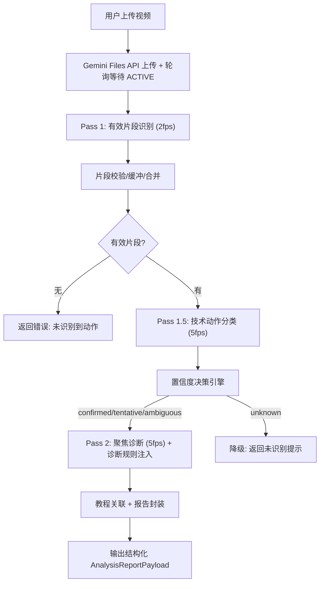
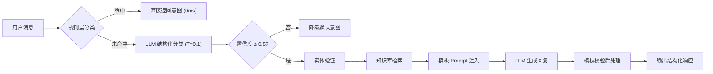
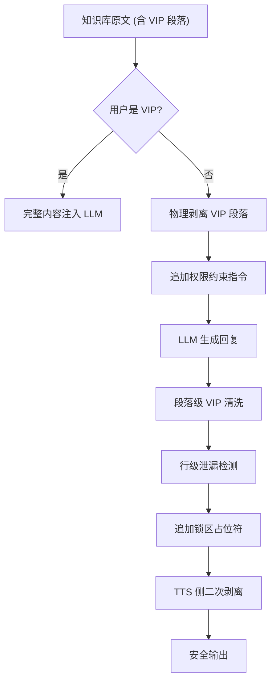

# Topstar（当家球星）发明专利分析报告

> 基于对产品完整代码库的深度审查，从**技术含量**、**新颖性**、**创造性**和**审查通过可行性**四个维度，筛选出以下 6 个推荐申请的发明专利点。

---

## 专利点一：基于多模态大模型的运动视频多阶段分析方法与系统

### 权利要求核心

一种基于多模态大语言模型的体育运动视频智能分析方法，包括：
1. **Pass 1（有效片段识别）**：以低帧率（2fps）将用户上传的运动视频送入多模态大模型，自动识别有效击球动作时间段，过滤捡球、休息、纯讲解等无效内容，输出结构化 JSON 片段列表；
2. **片段校验与智能合并**：对模型输出进行时间戳合法性校验、首尾缓冲扩充（前 3 秒 / 后 1 秒）、间隔 ≤5 秒的相邻片段自动合并，以及最大片段数限制；
3. **Pass 1.5（技术动作分类）**：以中帧率（5fps）对有效片段进行独立的技术动作分类，结合知识库中的正向/反向识别线索（positive/negative cues）、易混淆动作辨析矩阵（confusion matrix）和降级规则（downgrade rules），输出带置信度的分类结果；
4. **置信度决策引擎**：根据分类置信度和候选动作间概率差距（margin），进行四级决策（confirmed / tentative / ambiguous / unknown），自动决定进入深度诊断或降级；
5. **Pass 2（聚焦诊断）**：以高帧率（5fps）针对已确认的技术动作，注入知识库中的诊断规则（evidence → problem → advice），生成带时间戳的结构化诊断报告；
6. **教程自动关联**：根据诊断出的 action_id，从视频教程库中召回-评分-排序，自动附加相关教学视频。

### 技术方案详细说明

### 创新性分析

| 维度 | 说明 |
|------|------|
| **新颖性** | 现有技术中，运动视频分析多依赖传统计算机视觉（姿态估计/骨骼检测），本方案**首次提出基于多模态大模型的多阶段流水线**，将"片段切割→动作分类→聚焦诊断"解耦为三个独立 Pass，各 Pass 使用不同帧率和专业 Prompt |
| **创造性** | 三 Pass 分级帧率策略（2fps→5fps→5fps）在成本与精度之间取得平衡；置信度四级决策引擎避免低质量诊断；知识库驱动的诊断规则注入将专家经验系统化 |
| **实用性** | 已完整实现并在生产环境运行，处理真实乒乓球训练/比赛视频 |

### 代码对应位置

- [handleAnalysisJob.ts](file:///Users/dong/Documents/Dev/projects/topstar/server/orchestrator/handleAnalysisJob.ts) — 整体流水线
- [techniqueClassifier.ts](file:///Users/dong/Documents/Dev/projects/topstar/server/videoAnalysis/techniqueClassifier.ts) — Pass 1.5 分类
- [recognitionDecision.ts](file:///Users/dong/Documents/Dev/projects/topstar/server/videoAnalysis/recognitionDecision.ts) — 置信度决策引擎

### 审查通过可行性评估

> [!TIP]
> ⭐⭐⭐⭐⭐ **强烈推荐** — 这是技术含量最高、创新性最强的专利点。多阶段视频分析流水线（尤其是 Pass 1 → 1.5 → 2 的分级策略）和置信度决策引擎在公开文献中几乎没有对标方案，属于**首创性技术架构**，审查通过概率最高。

---

## 专利点二：基于视听交叉验证的运动动作识别方法

### 权利要求核心

一种结合视觉特征与音频语音指令的运动技术动作识别方法，包括：
1. **音频转录与置信度分级**：对视频音频流进行语音转录，并根据语音清晰度和技术相关性分为高/中/低三级置信度；
2. **视觉动作结构分析**：通过持拍手识别、击球动作解剖学结构分析，判断正手/反手方位，并输出方位置信度；
3. **视听交叉验证机制**：当音频中检测到短促单音节指令（如"蹲"/"对"等易混淆发音）时，强制结合画面中球员是否有对应肢体动作（如屈膝蓄力）来综合判断指令含义，避免环境噪声误判；
4. **方位禁止规则**：高置信度反手方位禁止输出正手动作ID，反之亦然；中低置信度不强制限制但标注不确定性；
5. **结构化推理链输出**：强制输出包含语音概要、语音置信度、方位判定、方位置信度、最终 action_id 及选择理由的完整推理链。

### 技术方案详细说明

本方法的核心创新在于 **视听交叉验证**——在嘈杂运动场馆环境下：
- 教练的短促口令（"拉"、"蹲"、"收"、"摩擦"）极易被击球声掩盖
- "对(dui)" 与 "蹲(dun)" 发音相近但含义截然不同
- 系统强制要求：**听到疑似指令时，必须查看画面中是否有对应动作验证**，而非单纯依赖语音识别结果

### 创新性分析

| 维度 | 说明 |
|------|------|
| **新颖性** | 现有运动分析系统要么纯视觉、要么纯语音，**未见将教练口令语音作为动作分类辅助信号并引入交叉验证的公开方案** |
| **创造性** | 三级语音置信度 + 方位禁止规则 + 结构化推理链，构成完整的多模态融合决策体系 |
| **实用性** | 在乒乓球馆等嘈杂环境下，该方法显著提升动作识别准确率 |

### 代码对应位置

- [techniqueClassifier.ts L69-L138](file:///Users/dong/Documents/Dev/projects/topstar/server/videoAnalysis/techniqueClassifier.ts#L69-L138) — 多模态推理约束 Prompt

### 审查通过可行性评估

> [!TIP]
> ⭐⭐⭐⭐⭐ **强烈推荐** — "视听交叉验证"是一个非常独特的创新点，尤其是**针对嘈杂体育场馆环境中教练短促口令与环境噪声的区分问题**，在运动科技领域几乎没有先例。建议与专利点一合并申请或独立申请均可。

---

## 专利点三：面向垂直领域的多层级意图分类与编排方法

### 权利要求核心

一种面向体育教练场景的智能对话意图分类与响应编排方法，包括：
1. **两层意图分类架构**：
   - **第一层（规则层）**：基于领域关键词库（含技术术语、品牌名、敏感词）进行确定性分类，零延迟、零成本，置信度 0.85-1.0；
   - **第二层（LLM 兜底层）**：规则未命中时，调用大模型进行结构化意图分类（低温度 0.1），输出 JSON 格式结果，包含主意图、次要意图、实体（action_id / equipment_query / tactic_topic）、置信度和判断理由；
   - **降级机制**：LLM 分类失败或置信度 < 0.5 时，自动降级到默认意图；
2. **实体验证与防编造**：LLM 返回的 action_id 与预加载的候选集交叉验证，不在候选集中的实体自动置 null；
3. **知识增强的上下文编排**：
   - 根据意图类型匹配领域知识库条目（关键词匹配 + 标题匹配）；
   - 按意图类型注入不同的输出模板 Prompt（动作分析 4 段 / 战术 2 段 / 器材 4 段）；
   - 模板校验后处理：检测 LLM 输出是否包含必要段落，缺失自动补全；
4. **次要意图联动**：主意图为 ACTION_COACHING 时，若次要意图包含 TUTORIAL_REQUEST，自动触发教程推荐模块。

### 技术方案详细说明

### 代码对应位置

- [intentRouter.ts](file:///Users/dong/Documents/Dev/projects/topstar/server/intent/intentRouter.ts) — 两层意图分类
- [handleChatEvent.ts](file:///Users/dong/Documents/Dev/projects/topstar/server/orchestrator/handleChatEvent.ts) — 编排主函数
- [templateValidator.ts](file:///Users/dong/Documents/Dev/projects/topstar/server/orchestrator/templateValidator.ts) — 模板校验

### 审查通过可行性评估

> [!TIP]
> ⭐⭐⭐⭐ **推荐** — "规则优先 + LLM 兜底"的两层分类架构虽然概念上不复杂，但其**与领域知识库、模板校验、实体防编造验证的完整组合**构成了一个完整的技术方案，具有足够的创造性。建议在撰写时强调"实体防编造验证"和"模板校验后处理"的技术细节。

---

## 专利点四：基于大模型的 VIP 内容分级保护与防泄漏方法

### 权利要求核心

一种在大语言模型应用中实现会员内容分级保护的方法，包括：
1. **入模前知识库物理剥离**：在将知识库内容注入 LLM 的 System Instruction 之前，使用正则表达式识别并物理移除 VIP 专属内容段落（如"核心秘诀"），使 LLM 在生成过程中**根本无法接触**到受保护内容；
2. **权限指令注入**：对非 VIP 用户，在 System Instruction 末尾追加强制权限约束（"绝对不能提及、改写、复述或暗示 VIP 内容"）；
3. **输出层多重脱敏**：
   - **段落级清洗**：正则匹配并移除 LLM 输出中的 VIP 段落标题及内容；
   - **行级泄漏检测**：逐行扫描非 VIP 段落，检测是否包含 VIP 相关敏感词（如"二次点火"、"喷射感"等），命中则删除该行；
   - **占位符强制下发**：若检测到存在 VIP 内容被剥离，自动在输出末尾追加 `[LOCKED_VIP_CONTENT]` 占位符，供前端渲染锁区 UI；
4. **TTS 语音合成侧保护**：在文字转语音前，额外剥离含"VIP"或"秘诀"标题的段落，防止语音通道泄露。

### 技术方案详细说明

### 创新性分析

| 维度 | 说明 |
|------|------|
| **新颖性** | 现有 LLM 应用的内容保护多依赖 Prompt 指令约束，本方案**首次提出"入模前物理剥离 + 出模后多重脱敏"的双向防护架构**，从信息论角度彻底阻断泄漏通道 |
| **创造性** | 四层防护（物理剥离→权限指令→段落清洗→行级检测）形成纵深防御，其中"行级泄漏检测"（基于领域敏感词扫描非 VIP 段落）是独特设计 |
| **实用性** | 解决了 LLM 应用中普遍存在的"Prompt 注入绕过内容限制"安全问题 |

### 代码对应位置

- [handleChatEvent.ts L84-L155](file:///Users/dong/Documents/Dev/projects/topstar/server/orchestrator/handleChatEvent.ts#L84-L155) — VIP 内容剥离与脱敏
- [geminiService.ts L254-L275](file:///Users/dong/Documents/Dev/projects/topstar/client/geminiService.ts#L254-L275) — TTS 侧 VIP 剥离

### 审查通过可行性评估

> [!TIP]
> ⭐⭐⭐⭐ **推荐** — LLM 内容安全是当前热点问题，"入模前物理剥离 + 出模后多重脱敏"的双向防护思路具有普适性和推广价值。审查时建议突出与纯 Prompt 约束方案的本质区别——**信息论层面的不可访问性**而非依赖模型遵从指令。

---

## 专利点五：面向体育教学的多维度视频教程智能推荐方法

### 权利要求核心

一种基于体育技术动作语义的视频教程智能推荐方法，包括：
1. **多信号源候选召回**：
   - action_id 精确匹配（动作 ID 关联）；
   - tag 语义匹配（标签交集）；
   - 标题关键词匹配（模糊召回）；
2. **多维度加权评分 rerank**：
   - 相关性基础分：action_id 匹配 +5、tag 命中 +2（上限）、标题命中 +0.5；
   - 可用性加分：active 状态 +1、suspect 状态 +0；
   - 质量修正：quality_score × 0.3 作为 rerank 修正项；
3. **链接健康感知**：
   - 定时任务（每日凌晨 3:00）自动检测教程链接可访问性；
   - 不可访问的链接标记为 suspect/dead，影响推荐排序；
   - 全部推荐结果为 suspect 时，前端附加 `links_unverified` 警告；
4. **对话上下文联动**：根据对话意图路由结果和知识库命中条目，自动提取搜索标签，触发推荐并嵌入对话响应；
5. **视频分析报告联动**：视频分析完成后，根据诊断出的 action_id 自动附加相关教学视频。

### 代码对应位置

- [recommendTutorials.ts](file:///Users/dong/Documents/Dev/projects/topstar/server/tutorials/recommendTutorials.ts) — 推荐主函数
- [scoreCandidate.ts](file:///Users/dong/Documents/Dev/projects/topstar/server/tutorials/scoreCandidate.ts) — 评分函数

### 审查通过可行性评估

> [!NOTE]
> ⭐⭐⭐ **可考虑** — 推荐算法本身的创新性中等，但"链接健康感知"和"对话/视频分析双通道联动触发"使其区别于通用推荐系统。建议与专利点一或专利点三合并为从属权利要求，增强整体专利的保护范围。

---

## 专利点六：面向体育领域的知识增强型大模型动作诊断方法

### 权利要求核心

一种将领域专家知识系统化为结构化规则库、并驱动大模型进行精准动作诊断的方法，包括：
1. **动作识别知识库构建**：
   - 每个技术动作定义正向识别线索（positive cues），含动作阶段（phase）、视觉特征（cue）和权重（weight）；
   - 定义反向排他线索（negative cues），减少误识别；
   - 构建易混淆动作辨析矩阵（confusion matrix），标注关键区别和所需视觉信息；
2. **动作诊断规则库构建**：
   - 每条规则包含：action_id、视觉证据（evidence）、问题诊断（problem）、优先级（priority）和训练建议（advice）；
   - 规则注入 LLM Prompt 后，模型按"若看到证据 X → 诊断为问题 Y → 建议 Z"的链式推理进行诊断；
3. **双库协同机制**：
   - 识别知识库用于 Pass 1.5 分类阶段，确保识别准确；
   - 诊断知识库用于 Pass 2 诊断阶段，确保建议专业；
   - 两个知识库通过 action_id 关联，形成"识别→诊断"的完整链路；
4. **Markdown 降级解析**：JSON 知识库不可用时，自动从 Markdown 格式的知识文件中提取正向线索和诊断规则，保证系统可用性。

### 代码对应位置

- [analysisKnowledgeLoader.ts](file:///Users/dong/Documents/Dev/projects/topstar/server/videoAnalysis/analysisKnowledgeLoader.ts) — 知识库加载与降级
- [techniqueClassifier.ts L37-L63](file:///Users/dong/Documents/Dev/projects/topstar/server/videoAnalysis/techniqueClassifier.ts#L37-L63) — 识别知识注入
- [handleAnalysisJob.ts L96-L112](file:///Users/dong/Documents/Dev/projects/topstar/server/orchestrator/handleAnalysisJob.ts#L96-L112) — 诊断规则注入

### 审查通过可行性评估

> [!TIP]
> ⭐⭐⭐⭐ **推荐** — "将专家经验结构化为 positive/negative cues + confusion matrix + diagnosis rules，驱动大模型进行链式推理诊断"这一技术方案具有清晰的创新性和广泛的推广价值（可扩展到高尔夫、网球等其他运动），建议独立申请。

---

## 总结与优先级建议

| 优先级 | 专利点 | 核心创新 | 推荐度 |
|--------|--------|----------|--------|
| 🥇 P0 | 专利点一 | 多模态视频多阶段分析流水线 + 置信度决策引擎 | ⭐⭐⭐⭐⭐ |
| 🥇 P0 | 专利点二 | 视听交叉验证动作识别 | ⭐⭐⭐⭐⭐ |
| 🥈 P1 | 专利点四 | VIP 内容入模前物理剥离 + 出模后多重脱敏 | ⭐⭐⭐⭐ |
| 🥈 P1 | 专利点六 | 知识增强型大模型动作诊断（双库协同） | ⭐⭐⭐⭐ |
| 🥉 P2 | 专利点三 | 多层级意图分类与编排 | ⭐⭐⭐⭐ |
| 🥉 P2 | 专利点五 | 链接健康感知的教程推荐 | ⭐⭐⭐ |

### 申请策略建议

> [!IMPORTANT]
> 1. **专利点一 + 二 + 六 可合并为一个大专利**：它们构成了完整的"视频上传 → 片段切割 → 视听融合识别 → 知识驱动诊断"技术链路，合并申请可以获得更宽的保护范围
> 2. **专利点四建议独立申请**：VIP 内容防泄漏方法具有跨领域通用性（不限于体育），独立申请可以保护更广的应用场景
> 3. **专利点三和五可作为从属权利要求**：并入大专利中作为系统层面的辅助创新点
> 4. **建议在申请前进行专利检索（FTO）**，尤其针对"多模态大模型视频分析"和"LLM 内容安全"两个热门方向

### 撰写注意事项

> [!WARNING]
> - 权利要求中**不要出现具体的模型名称**（如 Gemini、GPT），应使用"多模态大语言模型"等通用表述
> - 不要出现具体的编程语言或框架名称，应描述为"处理器"、"服务器"、"存储模块"等
> - 帧率、置信度阈值等参数应给出范围而非固定值（如"第一帧率为 1-3fps，第二帧率为 3-8fps"）
> - 每个专利点都应同时申请**方法权利要求**和**系统/装置权利要求**
