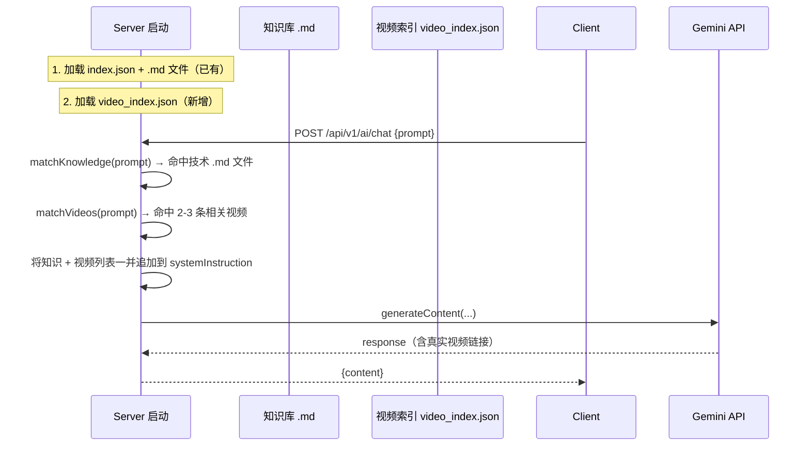

# 视频教程知识库方案

## 问题

当前 AI 回复中的【视频教程】部分由大模型随机编造，URL 和标题均不真实。用户已整理了 **5000+ 条** bilibili 收藏视频（CSV 格式，后续还会持续增加），需要建立一个"视频知识库"使 AI 能够根据用户问题推荐**最相关、最优质**的真实视频链接。

## 数据源分析

CSV 文件路径：`/Users/yingdongma/Documents/Dev/codex/output/bilibili-pingpong-favorites/favorites.csv`

| 字段 | 说明 | 示例 |
|------|------|------|
| `folder_title` | 分类文件夹名 | 乒乓_推挑、乒乓_发球_勾手逆旋转 |
| `video_title` | 视频标题 | 张继科教你推挑… |
| `intro` | 视频简介 | 可能为空或 `-` |
| `video_url` | bilibili 链接 | https://www.bilibili.com/video/BV1xxx |

> [!IMPORTANT]
> CSV 含 ~2600 条视频，按 `folder_title` 自然分为 40+ 类别（如 乒乓_拧拉、乒乓_搓球、乒乓_半出台 等），与现有知识库 `.md` 文件形成天然的 **topic → video** 映射。

## 架构设计



核心思路：**服务端加载视频索引 → 关键词匹配 → 注入 prompt → AI 直接引用真实链接**，与现有知识库检索机制完全一致，零侵入。

## Proposed Changes

### 数据预处理脚本

#### [NEW] [build_video_index.js](file:///Users/yingdongma/Documents/Dev/projects/Topstar/server/scripts/build_video_index.js)

一次性脚本，读取 CSV 并生成 `video_index.json`：

1. 过滤无效行（`video_title` 为"已失效视频"或空）
2. 从 `folder_title` 提取技术标签（如 `乒乓_推挑` → `推挑`、`乒乓_发球_勾手逆旋转` → `勾手发球`、`逆旋转发球`）
3. 从 `video_title` + `intro` 中提取高频关键词
4. 去重（同一 `bvid` 可能出现在多个文件夹中，合并 tags）
5. 输出结构化 JSON

---

### 视频索引文件

#### [NEW] [video_index.json](file:///Users/yingdongma/Documents/Dev/projects/Topstar/server/data/video_index.json)

由脚本自动生成，结构如下：

```json
{
  "videos": [
    {
      "bvid": "BV1SHzeBCEXX",
      "title": "接发球-高阶版：一个视频精通推挑",
      "url": "https://www.bilibili.com/video/BV1SHzeBCEXX",
      "tags": ["推挑", "接发球", "短球"],
      "sourceScore": 2,
      "teachScore": 2,
      "publishTime": 1769438611
    }
  ]
}
```

`sourceScore` 和 `teachScore` 在预处理阶段一次性算好，运行时零开销。
5000 条有效视频约 **1MB**，全量加载到内存约占 5MB。

---

### 服务端

#### [MODIFY] [index.js](file:///Users/yingdongma/Documents/Dev/projects/Topstar/server/index.js)

1. **启动时加载** `video_index.json` 到内存
2. **新增 `matchVideos(query)`**：对 `tags`、`title` 做关键词匹配，按**多维评分**排序（见评分策略章节），返回得分最高的 2-3 条视频
3. **修改 `/api/v1/ai/chat`**：在现有的知识注入之后，追加可推荐的视频列表到 `systemInstruction`

注入格式示例：
```
【可推荐的视频教程（请直接引用以下真实链接，不要编造）】
1. [接发球-高阶版：一个视频精通推挑！从此不再怕短球](https://www.bilibili.com/video/BV1SHzeBCEXX)
2. [张继科教你推挑(挑推)，比挑打的威胁大](https://www.bilibili.com/video/BV1f96VYyEh3)
```

---

### 客户端 prompt

#### [MODIFY] [geminiService.ts](file:///Users/yingdongma/Documents/Dev/projects/Topstar/client/geminiService.ts)

在 `UNIFIED_COACH_INSTRUCTION` 的【技术动作输出模板】——【视频教程】部分加入明确指令：

```
【视频教程】
请务必引用知识库中提供的真实视频链接，严禁编造 URL。
如果系统未提供视频链接，则输出"暂无匹配的视频教程"。
```

---

### 现有知识文件视频链接

#### [MODIFY] 所有 `.md` 知识文件的【视频教程】部分

将现有 `.md` 文件中的假 Google Drive 链接（如 `bh_flick.md` 中的 `drive.google.com` 链接）替换为 CSV 中对应的真实 bilibili 链接，或直接删除（由服务端动态注入更准确的视频）。

## 关键词映射策略

| folder_title | 提取的 tags | 对应知识文件 |
|---|---|---|
| 乒乓_推挑 | 推挑, 挑打 | — |
| 乒乓_拧拉 | 拧拉, 反手拧 | bh_flick.md |
| 乒乓_搓球 | 搓球, 搓长, 摆短 | — |
| 乒乓_发球_勾手逆旋转 | 勾手发球, 逆旋转, 发球 | hook_serve.md, serve_spin.md |
| 乒乓_半出台 | 半出台, 出台球 | — |
| 乒乓_接发球 | 接发球 | receive.md |
| 乒乓_反拉 | 反拉 | — |
| 乒乓_基础 | 握拍, 正手, 反手, 站位, 基础 | fh_drive.md, bh_drive.md |
| 乒乓_赛练结合 | 训练, 赛练, 步伐, 衔接 | — |
| 乒乓_理论 | 理论, 摩擦, 发力, 框架 | — |
| 乒乓_颗粒 | 长胶, 生胶, 正胶, 颗粒 | — |
| 乒乓_衔接 | 衔接, 转换 | — |

> [!TIP]
> 后续新增视频只需重新运行 `build_video_index.js` 即可更新索引，不需要改代码。

## 视频排序评分策略

同一关键词可能命中 50+ 条视频，需选出最优的 2-3 条。采用多维评分：

```
总分 = 标题相关度(0-5) + 来源权重(0-3) + 教学纯度(0-2) + 时效性(0-1)
```

### 标题相关度（运行时计算）
| 匹配情况 | 得分 | 示例 |
|---|---|---|
| 标题精确包含完整技术词 | +5 | 张继科教你**反手拧拉** |
| 标题包含部分关键词 | +2 | **反手**体系的接发球 |
| 仅在 tags 中命中 | +1 | tag 含拧拉但标题没提 |

### 来源权重（预处理计算 sourceScore）
| uploader 特征 | 得分 | 理由 |
|---|---|---|
| 张继科相关 | +3 | 品牌调性一致 |
| 全世爆/方博/国手 | +2 | 教学权威 |
| 其他教学号 | +1 | 一般 |
| 剪辑/搬运号 | 0 | 质量参差 |

### 教学纯度（预处理计算 teachScore）
| 标题特征 | 得分 |
|---|---|
| 含教学/教你/讲解/干货 | +2 |
| 含训练/演示/慢动作 | +1 |
| 含直播全程/比赛/赏析 | 0 |

### 时效性（运行时由 publishTime 计算）
| 发布时间 | 得分 |
|---|---|
| 近 1 年内 | +1 |
| 1 年以上 | 0 |

### 排序效果示例（问：反手拧拉怎么练）
| 视频 | 标题 | 来源 | 教学 | 时效 | 总分 |
|---|---|---|---|---|---|
| 张继科教你霸王拧！ | 5 | 3 | 2 | 1 | **11** |
| 张继科反手拧拉的秘诀是 | 5 | 3 | 1 | 1 | **10** |
| 前国手教学反手拧拉精髓 | 5 | 2 | 2 | 0 | **9** |
| 2025.11.17 直播训练全程 | 1 | 3 | 0 | 1 | 5 |

## 性能与成本分析

| 维度 | 数据 |
|---|---|
| 内存占用（5000 条） | 约 5MB，可忽略 |
| 内存占用（10000 条） | 约 10MB，仍可忽略 |
| Token 消耗 | 仅注入 2-3 条视频约 150 token |
| 检索耗时（5000 条） | 约 1-2ms |

### 扩展路径
| 视频数量 | 方案 |
|---|---|
| 1 万以内 | 当前关键词匹配（已设计） |
| 1-5 万 | 预构建倒排索引（改约 10 行代码） |
| 5万+ | 向量嵌入 + 语义检索 RAG |

## 工作量估算

| 步骤 | 工作内容 | 复杂度 |
|---|---|---|
| 1 | 编写 CSV → JSON 预处理脚本 | 中 |
| 2 | 服务端加载 + 匹配逻辑 | 低（复用现有模式） |
| 3 | 注入 prompt + 指令调整 | 低 |
| 4 | 现有 .md 假链接清理 | 低 |
| 5 | 验证 | 中 |

## Verification Plan

### 自动化验证
1. 运行 `build_video_index.js`，确认生成的 JSON 文件包含 1500+ 有效视频条目
2. 启动服务端，确认日志显示视频索引加载成功

### 手动验证
1. 问"反手拧拉怎么练" → 回复中【视频教程】应出现真实 bilibili 链接（含"拧拉"相关视频）
2. 问"勾手发球怎么发" → 应推荐勾手发球相关视频
3. 问"D09C怎么样"（器材问题） → 回复中不应包含视频教程部分
4. 确认不会出现编造的 URL
