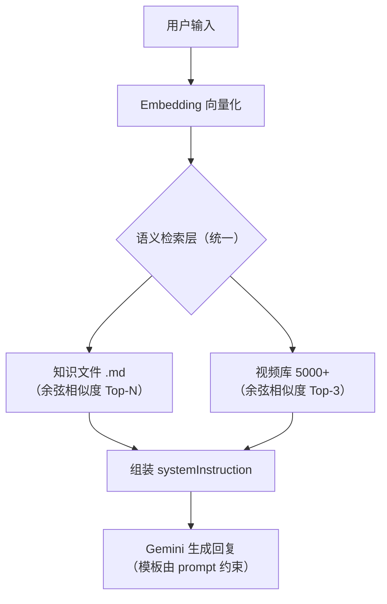

# Topstar 统一语义理解层方案

## 问题概述

当前 Topstar 的"理解用户 → 匹配内容 → 组装回复"链路存在**三处各自为政的字符串匹配**：

| 环节 | 当前实现 | 问题 |
|---|---|---|
| ①意图识别 | 写在 prompt 里让 Gemini 自行判断 | 不可控，偶尔不遵守模板 |
| ②知识检索 | `matchKnowledge()` 关键词 `includes()` | 同义词漏匹配、无语义理解 |
| ③视频推荐 | 尚未实现（即将新增） | — |

三者应共享同一套语义理解能力，而不是各做各的字符串匹配。

## 目标架构



核心变化：用 **embedding 向量相似度** 统一替代所有关键词匹配，一次向量化即可同时检索知识文件和视频。

## 现状分析（结合代码）

### 客户端 geminiService.ts
- `UNIFIED_COACH_INSTRUCTION`：包含 3 个输出模板（技术/战术/器材）
- 意图识别：通过 prompt 指令要求 Gemini 自行判断用户问题类型
- **问题**：Gemini 有时不遵守模板选择规则（之前已修复过一次）

### 服务端 server/index.js
- `matchKnowledge(query)`：遍历 13 个知识条目的 `keywords` 数组，逐个 `includes()` 匹配
- 匹配结果注入 `systemInstruction` 后发送给 Gemini
- **问题**：用户说"下旋球"匹配不到"搓球"知识文件，说"暴冲"匹配不到"正手拉球"

### 知识索引 index.json
- 13 个条目，每个有手动维护的 `keywords` 数组
- **问题**：同义词覆盖不全，维护成本高

## 方案设计

### 核心思路

1. **预处理阶段**：对每个知识文件和每条视频生成 embedding 向量并持久化
2. **运行时**：用户输入 → 生成 query embedding → 余弦相似度检索知识 + 视频 → 注入 prompt
3. **意图识别**：保持 prompt 指令方式（Gemini 本身就很擅长），仅通过注入的知识内容来辅助

### 为什么不用 embedding 做意图分类？

> [!NOTE]
> 意图分类（技术/器材/战术/闲聊）只有 4 个类别，用 embedding 做分类是大材小用。Gemini 通过 prompt 指令判断意图已经足够好（之前修复后效果稳定），且这样做能保持架构简洁。**真正需要语义理解的是"匹配哪些知识文件"和"匹配哪些视频"**。

### 技术选型

| 组件 | 选择 | 理由 |
|---|---|---|
| Embedding 模型 | `gemini-embedding-001` | 已有 `@google/genai` SDK，零新增依赖 |
| 向量存储 | JSON 文件 + 内存 | 数据量小（<1万条），不需要向量数据库 |
| 相似度算法 | 余弦相似度 | 标准做法，10 行代码即可实现 |

## Proposed Changes

### 预处理脚本

#### [NEW] [build_embeddings.js](file:///Users/yingdongma/Documents/Dev/projects/Topstar/server/scripts/build_embeddings.js)

统一的预处理脚本，一次性生成所有 embedding：

```javascript
// 伪代码示意
async function main() {
  // 1. 知识文件 embedding（13 条）
  for (const entry of knowledgeIndex) {
    const text = entry.title + ' ' + entry.keywords.join(' ') + ' ' + contentSummary;
    entry.embedding = await ai.models.embedContent({
      model: 'gemini-embedding-001',
      contents: text
    });
  }
  // 输出 → knowledge_embeddings.json

  // 2. 视频 embedding（5000+ 条）
  for (const video of videos) {
    const text = video.title + ' ' + video.tags.join(' ');
    video.embedding = await ai.models.embedContent({
      model: 'gemini-embedding-001', 
      contents: text
    });
  }
  // 输出 → video_embeddings.json
}
```

> [!TIP]
> `gemini-embedding-001` 支持批量调用，5000 条视频 + 13 条知识，预处理成本约 **$0.01**。

---

### 数据文件

#### [NEW] [knowledge_embeddings.json](file:///Users/yingdongma/Documents/Dev/projects/Topstar/server/data/knowledge_embeddings.json)

```json
[
  {
    "id": "bh_flick",
    "title": "反手拧拉",
    "category": "actions",
    "embedding": [0.012, -0.034, ...],  // 768 维向量
    "content": "..."
  }
]
```

#### [NEW] [video_embeddings.json](file:///Users/yingdongma/Documents/Dev/projects/Topstar/server/data/video_embeddings.json)

```json
[
  {
    "bvid": "BV1SHzeBCEXX",
    "title": "一个视频精通推挑",
    "url": "https://www.bilibili.com/video/BV1SHzeBCEXX",
    "embedding": [0.023, -0.017, ...],
    "sourceScore": 2,
    "teachScore": 2
  }
]
```

---

### 服务端

#### [MODIFY] [index.js](file:///Users/yingdongma/Documents/Dev/projects/Topstar/server/index.js)

##### 变更 1：启动时加载 embedding 数据

```javascript
// 替代现有的 knowledgeStore + knowledgeIndex
let knowledgeEmbeddings = [];  // { id, title, category, embedding, content }
let videoEmbeddings = [];      // { bvid, title, url, embedding, sourceScore, teachScore }

function loadEmbeddings() {
  knowledgeEmbeddings = JSON.parse(fs.readFileSync('data/knowledge_embeddings.json'));
  videoEmbeddings = JSON.parse(fs.readFileSync('data/video_embeddings.json'));
  console.log(`[Semantic] Loaded ${knowledgeEmbeddings.length} knowledge + ${videoEmbeddings.length} video embeddings`);
}
```

##### 变更 2：统一语义检索函数

```javascript
function cosineSimilarity(a, b) {
  let dot = 0, normA = 0, normB = 0;
  for (let i = 0; i < a.length; i++) {
    dot += a[i] * b[i];
    normA += a[i] * a[i];
    normB += b[i] * b[i];
  }
  return dot / (Math.sqrt(normA) * Math.sqrt(normB));
}

async function semanticSearch(query) {
  // 1. 用户输入向量化（唯一的运行时 API 调用）
  const queryEmbedding = await ai.models.embedContent({
    model: 'gemini-embedding-001',
    contents: query
  });

  // 2. 检索知识文件（Top-3）
  const knowledgeResults = knowledgeEmbeddings
    .map(k => ({ ...k, score: cosineSimilarity(queryEmbedding, k.embedding) }))
    .sort((a, b) => b.score - a.score)
    .filter(k => k.score > 0.5)  // 相似度阈值
    .slice(0, 3);

  // 3. 检索视频（Top-3，结合质量分加权）
  const videoResults = videoEmbeddings
    .map(v => ({
      ...v,
      finalScore: cosineSimilarity(queryEmbedding, v.embedding) * 10
                  + v.sourceScore + v.teachScore
    }))
    .sort((a, b) => b.finalScore - a.finalScore)
    .slice(0, 3);

  return { knowledge: knowledgeResults, videos: videoResults };
}
```

##### 变更 3：修改 /api/v1/ai/chat 端点

```javascript
app.post('/api/v1/ai/chat', async (req, res) => {
  const { prompt, systemInstruction, history } = req.body;
  
  // 统一语义检索（替代原有的 matchKnowledge）
  const { knowledge, videos } = await semanticSearch(prompt);
  
  let enriched = systemInstruction;
  
  // 注入知识
  if (knowledge.length > 0) {
    enriched += '\n\n以下是相关的专业知识库：\n';
    for (const k of knowledge) {
      enriched += `【${k.title}】\n${k.content}\n\n`;
    }
  }
  
  // 注入视频（仅当检索到技术类知识时）
  if (videos.length > 0 && knowledge.some(k => k.category === 'actions')) {
    enriched += '\n【可推荐的视频教程（严禁编造，只能引用以下链接）】\n';
    for (const v of videos) {
      enriched += `[${v.title}](${v.url})\n`;
    }
  }
  
  // ... 调用 Gemini（不变）
});
```

---

### 客户端

#### [MODIFY] [geminiService.ts](file:///Users/yingdongma/Documents/Dev/projects/Topstar/client/geminiService.ts)

在 `UNIFIED_COACH_INSTRUCTION` 中：
- 【视频教程】部分加入兜底指令：`如果系统未提供视频链接，严禁回复任何链接，必须说"暂无相关真实视频推荐"`
- 保持意图识别逻辑不变（已经稳定工作）

---

### 清理

#### [MODIFY] [index.json](file:///Users/yingdongma/Documents/Dev/projects/Topstar/client/src/assets/knowledge/index.json)

`keywords` 数组不再作为检索依据（改用 embedding），但保留不删除，可作为人读参考。

## 成本分析

| 环节 | 成本 |
|---|---|
| 预处理（一次性） | 5000 视频 + 13 知识 = ~$0.01 |
| 运行时（每次请求） | 1 次 embedding 调用 ≈ $0.00001 |
| 内存（embedding 数据） | 5000 × 768 维 × 4 字节 ≈ 15MB |

与当前纯关键词方案对比：

| | 关键词匹配 | Embedding 语义检索 |
|---|---|---|
| 运行时 API 调用 | 0 | +1 次 embedding（约 10ms） |
| 每次请求额外成本 | $0 | $0.00001 |
| 匹配质量 | 60-70%（依赖手动关键词） | 90%+（自动语义理解） |
| 维护成本 | 高（需手动维护关键词+同义词） | 极低（新增内容只需跑一次脚本） |

> [!IMPORTANT]
> 每次请求多一次 embedding 调用（约 10ms + $0.00001），但彻底消除了"关键词覆盖不全"的根本问题，且不需要维护同义词字典。

## 与视频方案的关系

本方案**包含并升级**了 `01_Video_Tutorial_KB_Solution.md` 中的视频推荐功能：

| 01 方案（视频专用） | 本方案（统一语义层） |
|---|---|
| 关键词匹配视频 | Embedding 检索视频 |
| 多维评分排序 | Embedding 相似度 + 质量分加权 |
| 只处理视频 | 统一处理知识 + 视频 |
| 需要同义词字典 | 不需要 |

**01 方案中的 `sourceScore` 和 `teachScore` 机制保留**——作为 embedding 相似度之外的加权因子，确保推荐的不仅"相关"而且"优质"。

## 实施步骤

| 步骤 | 工作 | 依赖 |
|---|---|---|
| 1 | 编写 `build_embeddings.js` 预处理脚本（处理知识+视频+CSV） | 无 |
| 2 | 运行脚本生成 `knowledge_embeddings.json` + `video_embeddings.json` | 步骤 1 |
| 3 | 重构 `server/index.js`：替换 `matchKnowledge()` 为 `semanticSearch()` | 步骤 2 |
| 4 | 更新 `geminiService.ts` 中的视频兜底指令 | 无 |
| 5 | 清理知识文件中的假视频链接 | 无 |
| 6 | 验证 | 步骤 3-5 |

## 验证计划

### 语义检索质量
| 用户输入 | 期望命中的知识 | 期望命中的视频类别 |
|---|---|---|
| 下旋球接不好 | receive.md（搓球与摆短） | 搓球/接发球类 |
| 暴冲怎么拉 | fh_loop.md（正手拉球） | 正手弧圈类 |
| 霸王拧 | bh_flick.md（反手拧拉） | 拧拉类 |
| D09C好用吗 | rubber_d09c（器材） | 无视频推荐 |
| 被长球顶住 | direct_match_logic（战术） | 无视频推荐 |

### 回归测试
- 确认所有模板选择行为不变
- 确认 VIP 内容不被 TTS 朗读（之前的 fix）
- 确认器材问题不推荐视频
