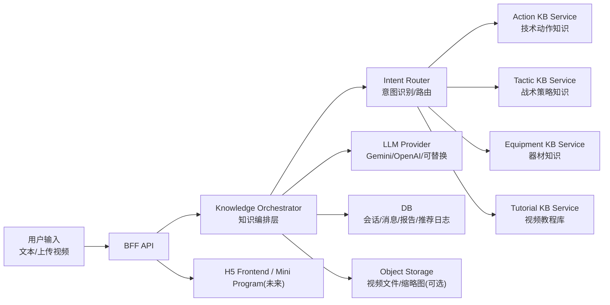
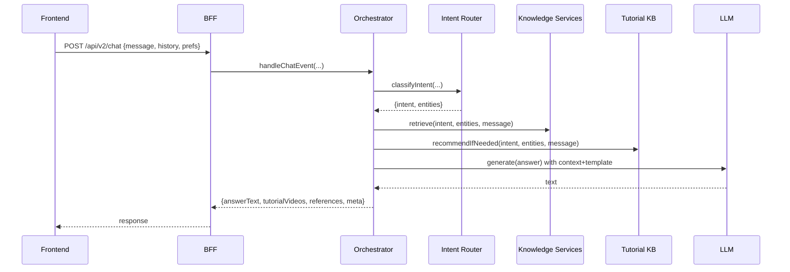

# Topstar 产品技术设计文档（Codex 版）

更新日期：2026-03-15  
状态：可落地（MVP -> 可演进生产级）  
范围：知识库系统 + 意图识别 + 知识编排层 + 回复模板（结构化输出）+ 教程推荐 + 视频分析任务化 + 数据持久化

---

## 0. 背景与现状（基于当前代码库）

Topstar 当前形态是一个移动端 H5（React + Vite）+ 轻量 BFF（Express）：

- 前端通过 `/api/v1/ai/chat` 获取 AI 文本回复，并渲染结构化样式（`【...】` 标题、VIP 区块遮罩、TTS 播放等）。
- 服务端对本地知识库（`client/src/assets/knowledge/*.md`）做关键词检索，将命中内容拼接到 `systemInstruction` 再调用模型。
- “上传视频分析”的核心报告结果当前仍是前端模拟（`setTimeout` + mock report），没有真实的视频分析链路。

本设计文档的目标是：把“知识库系统 + 意图识别 + 回复模板 + 教程推荐 + 视频分析”统一成一个可维护、可扩展、可持续迭代的生产级架构，同时保持当前产品体验不被推翻重来。

---

## 1. 目标与非目标

### 1.1 目标（我们要交付什么）

1. **统一知识系统**：技术动作、战术策略、器材、视频教程都纳入统一知识服务，但保持域内模型/数据结构的差异化（不一锅炖）。
2. **可控意图识别**：把“用户问题属于哪类需求（动作/战术/器材/教程/视频分析）”变成可观察、可回归的逻辑，而不是完全交给模型自由发挥。
3. **知识编排层落地**：把“要检索哪些库、拿哪些上下文、怎么组装输出、如何降级”集中在服务端编排层，避免逻辑分散在 prompt/前端/mock。
4. **结构化输出协议**：服务端返回结构化 JSON（文本 + 报告 + 教程列表 + 引用），前端稳定渲染；同时维持现有 `【...】` 样式文本兼容。
5. **教程推荐真实化**：把“视频教程链接推荐”从“模型编造/前端 mock”改成来自你的收藏视频教程库（B 站/抖音链接集合）。
6. **视频分析任务化**：上传视频 -> 生成 analysis job -> 异步处理 -> 回传报告（可轮询/长轮询/后续可 SSE）。
7. **持久化与可观测性**：会话、消息、报告、推荐结果、token 使用量可记录；服务端可做审计、限流、错误码。

### 1.2 非目标（当前不做）

- 不在 MVP 阶段引入复杂的向量数据库或大规模 RAG 体系（可留扩展点）。
- 不在 MVP 阶段实现完整的用户/支付/VIP 商业化闭环（只做必要的鉴权与分级能力）。
- 不在 MVP 阶段把外链视频“搬运/转码/托管”到自有 CDN（先做外链资产化与可用性治理）。

---

## 2. 术语与核心概念

- **知识域（Knowledge Domain）**：技术动作、战术策略、器材、教程视频四个域。
- **知识资产（Knowledge Asset）**：一个可被检索、可被引用的内容单元（如一篇动作 `.md`、一条教程视频元数据）。
- **意图（Intent）**：用户请求类型（例如 `ACTION_COACHING`、`TACTIC_ADVICE`、`EQUIPMENT_QA`、`TUTORIAL_REQUEST`、`VIDEO_ANALYSIS`）。
- **编排层（Orchestrator）**：一个服务端入口，负责预处理、意图路由、检索、上下文组装、调用模型、后处理、降级与输出协议。
- **输出模板（Template）**：规范化输出结构，保证前端可渲染、用户可读、可测试。

---

## 3. 总体架构

### 3.1 逻辑架构



### 3.2 MVP 物理部署

- 前端：Vite 静态资源（H5）。
- 后端：Node.js（Express）BFF。
- 数据：MVP 可用 SQLite（或直接 JSON + 文件），生产建议 PostgreSQL。
- 文件：视频上传先用对象存储（S3/R2/OSS），MVP 可先落本地磁盘（仅开发环境）。

---

## 4. 知识系统设计（四个域）

### 4.1 技术动作知识库（Actions）

**载体**：Markdown（保留现状，便于迭代）。  
**索引**：`index.json` + metadata（title/category/keywords）。  
**主键**：`action_id`（例如 `bh_flick`, `fh_loop`）。  
**用途**：

- 作为动作问答的“权威上下文”注入给模型。
- 作为报告卡片的“动作要领/常见问题/训练建议”来源。
- 作为教程推荐的锚点（教程视频关联到 `action_id`）。

**范例（MVP 建议保持与现状兼容）**：

动作索引条目（示例，来源于 `client/src/assets/knowledge/index.json` 的结构）：

```json
{
  "id": "bh_flick",
  "title": "反手拧拉",
  "category": "actions",
  "file": "actions/bh_flick.md",
  "keywords": ["拧拉", "反手拧", "台内拧", "张继科拧拉", "架肘"]
}
```

动作知识文件片段（示例，`actions/bh_flick.md` 风格）：

```md
### 【动作要领】
引拍时前臂外旋，拍头略高于手腕；击球点在身体前侧，向前上摩擦为主。

### 【常见问题】
1) 只“甩手腕”不蹬转，球缺底劲
2) 拍型过亮，容易出界

### 【训练建议】
多球：短下旋到反手位，先做薄摩擦，再逐步提速；要求每板击球点一致。
```

### 4.2 战术策略知识库（Tactics）

**载体**：Markdown（可保留现状）。  
**主键**：`tactic_id`（可从现有文件 id 推导）。  
**用途**：

- 解决“实战表现 -> 战术建议”的映射。
- 可直接为模型提供“策略映射矩阵”上下文。

**范例（战术映射条目片段）**：

```md
## 【表现与策略映射矩阵】

现象：被对方反手大角长球顶住
定性：节奏被压制，挥拍空间被挤压
建议（对自己）：别往后躲，球一起跳就迎上去，借力带回去
建议（对对手）：继续追身长球，限制引拍空间
```

### 4.3 器材知识库（Equipment）

**载体**：Markdown/结构化（MVP 可沿用 Markdown）。  
**主键**：`equipment_id`（如 `rubber_d09c`）。  
**用途**：

- 器材问答与推荐，需要更结构化输出（性能特点/适合打法/价格区间）。

**范例（器材条目，Markdown 承载结构化字段）**：

```md
## 【性能特点】
粘性套胶，台内小球控制稳定；发力后底劲强，容错高。

## 【适合打法】
发力出色的进攻型选手

## 【代表运动员】
樊振东、奥恰洛夫

## 【价格区间】
390-490 元
```

### 4.4 视频教程知识库（Tutorials）

这是本次落地的关键新增域。

**数据来源**：你长期收藏整理的抖音/B 站链接集合（网页可访问链接）。  
**MVP 目标**：让系统能可靠地回答：

- “给我一个反手拧拉视频教程”
- “动作分析报告卡片里的视频教程推荐（真实链接）”

**建议资产化字段（最少集）**：

- `tutorial_id`: 全局唯一（建议 `platform:item_id`）
- `platform`: `bilibili` / `douyin`
- `platform_item_id`: bvid/aweme_id/或平台 ID
- `title`
- `url`
- `author`（可空）
- `source_folder_title`（来自收藏夹分类，用于标签）
- `tags`: `["拧拉","接发球","台内"]`（可自动 + 人工修订）
- `related_action_ids`: `["bh_flick"]`（强关联，最重要）
- `related_tactic_ids`: 可选
- `quality_score`: 可选（先手工少量标注也行）
- `status`: `active|dead|suspect`
- `last_verified_at`: 可选

**注意**：教程库是“资源层”，不替代动作/战术/器材的解释层。动作/战术/器材给“怎么做/为什么”，教程给“看什么学”。

**范例（教程资产记录，建议先用 JSON 文件加载到内存）**：

建议存放位置（MVP）：`server/data/tutorials.json`

```json
[
  {
    "tutorial_id": "bilibili:BV1SHzeBCEXX",
    "platform": "bilibili",
    "platform_item_id": "BV1SHzeBCEXX",
    "title": "接发球-高阶版：一个视频精通推挑",
    "url": "https://www.bilibili.com/video/BV1SHzeBCEXX",
    "author": "某某教练",
    "source_folder_title": "乒乓_推挑",
    "tags": ["推挑", "接发球", "短球"],
    "related_action_ids": [],
    "related_tactic_ids": [],
    "quality_score": 2,
    "status": "active",
    "last_verified_at": "2026-03-01"
  },
  {
    "tutorial_id": "bilibili:BV1f96VYyEh3",
    "platform": "bilibili",
    "platform_item_id": "BV1f96VYyEh3",
    "title": "张继科教你霸王拧：台内拧拉关键细节",
    "url": "https://www.bilibili.com/video/BV1f96VYyEh3",
    "author": "张继科",
    "source_folder_title": "乒乓_拧拉",
    "tags": ["拧拉", "反手拧", "台内", "接发球"],
    "related_action_ids": ["bh_flick"],
    "related_tactic_ids": [],
    "quality_score": 3,
    "status": "active",
    "last_verified_at": "2026-03-10"
  }
]
```

教程与动作强关联的意义（示例）：

- `bh_flick`（反手拧拉动作知识）可以稳定挂载 `related_action_ids=["bh_flick"]` 的教程视频
- 即使用户问法变化（“霸王拧”“反手台内上手”），依然可以先解析出 `action_id=bh_flick` 再检索教程库

**标准化教程库文件（落地数据结构，供后端直接检索）**：

Topstar 当前已将“抖音 + B 站”合并后的收藏数据标准化为一个可直接加载的索引文件（不修改原始数据源）：

- 输出文件（示例）：`server/data/tutorials.pingpong-merged.normalized.json`
- 生成脚本（示例）：`server/scripts/normalize_pingpong_merged_tutorials.js`

顶层结构（schema）：

```json
{
  "version": "1.0",
  "generated_at": "2026-03-15T00:00:00.000Z",
  "source": {
    "input_path": "/Users/yingdongma/Documents/Dev/codex/output/pingpong-merged/favorites.json",
    "sources": null,
    "counts": null,
    "row_count": 5621,
    "unique_count": 4834
  },
  "tutorials": [
    {
      "tutorial_id": "douyin:7326540208017509670",
      "platform": "douyin",
      "platform_item_id": "7326540208017509670",
      "title": "#乒乓球教学 #乒乓小将",
      "url": "https://www.douyin.com/video/7326540208017509670",
      "author": null,
      "source_folder_titles": ["乒乓__核心_基本功", "乒乓_衔接及组合"],
      "tags": ["核心", "基本功", "衔接", "组合"],
      "related_action_ids": [],
      "related_tactic_ids": [],
      "quality_score": 0,
      "status": "active",
      "last_verified_at": null,
      "created_time": 0,
      "saved_time": 0,
      "duration": null,
      "description": null,
      "raw": {
        "item_id": "7326540208017509670",
        "item_id_type": "aweme_id",
        "bvid": null,
        "aid": null,
        "aweme_id": "7326540208017509670"
      }
    }
  ]
}
```

`tutorials[]` 字段说明（后端检索用最关键字段）：

- `tutorial_id`: 全局唯一主键，固定为 `${platform}:${platform_item_id}`
- `platform/platform_item_id/url/title`: 用于展示与跳转
- `source_folder_titles`: 来自收藏夹的分类来源（用于做 tags 归纳与追溯）
- `tags`: 用于关键词召回与过滤
- `related_action_ids`: 与动作知识的强关联（用于“报告卡片/动作问答”稳定推荐）
- `status/last_verified_at`: 用于外链可用性治理（死链过滤、替换）

---

## 5. 意图识别（Intent）与路由（Router）

### 5.1 Intent 列表（MVP）

- `ACTION_COACHING`：动作怎么练/要领/纠错
- `TACTIC_ADVICE`：实战问题/对抗策略/复盘
- `EQUIPMENT_QA`：器材咨询/搭配推荐
- `TUTORIAL_REQUEST`：明确要视频教程/示范视频
- `VIDEO_ANALYSIS`：上传视频并产出分析报告
- `OFF_TOPIC`：非乒乓球话题

### 5.2 识别策略（先稳再强）

MVP 建议采用“规则优先 + 模型兜底”的混合策略：

1. 规则强命中（高置信度）：
   - 包含“视频教程/教学视频/示范视频/给我个视频/链接” -> `TUTORIAL_REQUEST`
   - 包含“上传视频/我拍了/我录了/帮我看视频”或 event=video -> `VIDEO_ANALYSIS`
   - 明确器材实体（胶皮/底板/套胶型号） -> `EQUIPMENT_QA`
2. 其余交给模型结构化分类（返回 JSON），并限制输出 schema：
   - `intent`
   - `entities`（如 `action_id` 候选、器材型号）
   - `confidence`

这样好处是：关键路径可控、可测；复杂语义再用模型补齐。

### 5.3 语义意图识别（后续正式方案，基于大模型）

当产品从 MVP 进入“可持续扩展”阶段，我们需要把意图识别从“关键词覆盖率”升级为“语义理解能力”。这里的语义能力主要来自大模型：它能理解同义表达、隐含需求、上下文指代，并且能同时做实体抽取（例如把“霸王拧”归一到 `action_id=bh_flick`）。

**核心原则**：

1. 规则仍然保留，但只承担“高精度强约束”（例如检测上传视频事件、强器材词、合规拦截）。
2. 大模型承担“语义分类 + 关键实体抽取”，输出必须是结构化 JSON，便于回归测试与监控。
3. 大模型输出不直接决定最终渲染文本，而是决定：调用哪些知识域、使用哪个模板、是否触发教程推荐/任务化分析。

**建议的结构化输出 Schema（示例）**：

```json
{
  "intent": "ACTION_COACHING",
  "secondary_intents": ["TUTORIAL_REQUEST"],
  "entities": {
    "action_id": "bh_flick",
    "equipment_query": null,
    "tactic_topic": null
  },
  "confidence": 0.86,
  "reason": "用户在问反手拧拉怎么练并明确要视频教程"
}
```

字段说明（MVP 可先不全用，但 schema 先定）：

- `intent`：主意图（用于模板选择与主要知识域检索）
- `secondary_intents`：次意图（例如动作问答 + 教程请求）
- `entities.action_id`：动作归一化后的主键（例如 `bh_flick`）
- `confidence`：用于降级/兜底的置信度
- `reason`：仅用于日志与调试（不要回传给用户）

**运行时策略（推荐）**：

1. 先走规则层：
   - 命中强规则 -> 直接返回 intent（例如上传视频 -> `VIDEO_ANALYSIS`）
2. 否则走 LLM 意图识别（独立一次轻量调用，或与生成合并为一次调用）：
   - 低置信度（如 `<0.6`）或输出不符合 schema -> 回退到规则/默认意图（通常为 `ACTION_COACHING` 或 `TACTIC_ADVICE`）
3. 最终意图进入编排层：
   - 决定检索哪些知识域、是否拉教程、是否触发任务化视频分析、选用哪个输出模板

**模型提示词（Prompt）设计要点**：

- 明确告诉模型“只能输出 JSON，不要输出解释文字”
- 把可选 `intent` 枚举写死（减少漂移）
- 把 `action_id` 的可选集合（来自动作索引）作为候选注入，要求模型在候选中选择或置空（减少编造）

**评估与演进（强烈建议做）**：

- 建一个 `intent_eval_set.jsonl`（几十到几百条就够）：包含用户原话、期望 intent、期望 action_id（若适用）
- 每次改 prompt 或升级模型后跑离线评估，记录准确率/混淆矩阵
- 在线记录：intent、confidence、后续用户是否继续追问（作为弱监督信号）

这样我们可以在不牺牲可控性的前提下，把意图识别真正升级到语义层面，并且可持续迭代。

---

## 6. 知识编排层（Orchestrator）

你之前的直觉是对的：用户进来“第一步是意图识别”。编排层存在的意义是把意图识别放到一个更大的“把事办成”的流程里，并统一：

- 预处理（上下文裁剪、用户设置、权限）
- 路由（查哪些库）
- 检索（动作/战术/器材/教程）
- 上下文组装（system instruction + references）
- 调用模型（chat / tts / image / 未来 video）
- 后处理（模板校验、敏感输出过滤、降级）
- 输出协议（前端稳定渲染）

### 6.1 编排流程（文本问答）



### 6.2 编排流程（视频分析）

MVP 建议把视频分析改成“任务化”，避免长请求卡住：

1. `POST /api/v2/analysis/jobs`：创建任务（返回 job_id）
2. `PUT /api/v2/analysis/jobs/{id}/upload`：上传视频或提交已上传 URL
3. 后端异步执行分析（可先用模型做文本分析占位，后续接真正视频理解）
4. `GET /api/v2/analysis/jobs/{id}`：查询状态与最终报告

前端可用轮询展示 ProcessingCard（替换当前 setTimeout mock）。

---

## 7. 输出协议（Response Contract）与回复模板（Templates）

### 7.1 为什么要结构化协议

仅返回一段文本会导致：

- 教程链接只能靠模型“记得写对链接”
- 报告卡片只能靠模型“写成你想要的结构”
- 任何 UI 想升级都要改 prompt 并赌模型稳定性

所以建议服务端返回结构化 JSON，前端渲染更稳定。

### 7.2 `ChatResponse`（建议）

```json
{
  "success": true,
  "answerText": "第一行一句总结...\n\n【动作要领】...\n",
  "intent": "ACTION_COACHING",
  "references": [
    { "type": "action_doc", "id": "bh_flick", "title": "反手拧拉" }
  ],
  "tutorialVideos": [
    { "tutorial_id": "bilibili:BV1xxx", "title": "张继科教你霸王拧", "url": "https://www.bilibili.com/video/BV1xxx", "platform": "bilibili" }
  ],
  "report": null,
  "meta": {
    "request_id": "uuid",
    "cost": { "input_tokens": 0, "output_tokens": 0 },
    "degraded": false
  }
}
```

### 7.3 模板规范（与前端渲染对齐）

#### A) 动作类（ACTION_COACHING）

- 必须包含：`【动作要领】`、`【常见问题】`、`【训练建议】`、`【视频教程】`
- `【视频教程】` 的链接优先来自 `tutorialVideos`，文本中若无可用链接则输出“暂无匹配的视频教程”
- `【核心秘诀(VIP专属)】` 作为可选段（由服务端权限决定是否下发完整内容）

#### B) 战术类（TACTIC_ADVICE）

- 必须包含：`【存在问题/定性分析】`、`【改进建议/实战策略】`
- 总字数约束由服务端做后处理截断/提示，不完全依赖模型自觉

#### C) 器材类（EQUIPMENT_QA）

- 必须包含：`【性能特点】`、`【适合打法】`、`【代表运动员】`、`【价格区间】`
- 推荐方案需要先补问关键条件（打法/预算/咨询品类）

#### D) 教程请求（TUTORIAL_REQUEST）

- 文本回答极简：给 1 句为什么推荐 + 1-3 个链接
- 真正的链接以 `tutorialVideos` 数组为准

#### E) 视频分析（VIDEO_ANALYSIS）

- `report` 字段返回结构化 `AnalysisReport`（见下节）
- 同时可给简短 `answerText` 作为摘要

---

## 8. `AnalysisReport` 数据模型（前端报告卡片对齐）

沿用当前前端 `AnalysisReportCard` 需要的结构（并扩展字段）：

```json
{
  "techName": "正手技术诊断报告",
  "variant": "gradient",
  "problems": [
    { "text": "重心交换不足，底劲不够。", "timestamp": "00:04" }
  ],
  "improvements": [
    "加强下肢蹬转训练...",
    "练习拉下旋时从后中下部向上摩擦..."
  ],
  "videoLinks": [
    { "title": "樊振东正手拉球慢动作示范", "url": "https://www.bilibili.com/video/BV1xxx" }
  ]
}
```

其中 `videoLinks` 不再来自前端 mock，而是来自教程库推荐服务。

---

## 9. API 设计（建议 v2，不破坏现有 v1）

现有接口保留：

- `POST /api/v1/ai/chat`
- `POST /api/v1/ai/tts`
- `POST /api/v1/ai/image`

新增 v2（结构化输出 + 任务化）：

1. `POST /api/v2/chat`
   - 输入：`message`, `history`, `prefs`
   - 输出：`ChatResponse`
2. `POST /api/v2/tutorials/recommend`
   - 输入：`query`, `action_id?`, `limit?`
   - 输出：`tutorialVideos[]`
3. `POST /api/v2/analysis/jobs`
   - 创建分析任务：返回 `job_id`
4. `PUT /api/v2/analysis/jobs/{job_id}/upload`
   - 上传或提交 `video_url`
5. `GET /api/v2/analysis/jobs/{job_id}`
   - 查询状态：`queued|running|done|failed` + `report`

---

## 10. 数据持久化（MVP -> 生产）

### 10.1 MVP（最快落地）

- 会话与消息：SQLite（或轻量 JSON 文件，建议 SQLite 起步）
- 教程库：JSON 文件加载到内存 + 简单倒排/标签索引
- 报告结果：保存到 `analysis_jobs` 表（或文件）

### 10.2 生产建议（PostgreSQL）

核心表（建议）：

- `users`
- `chat_sessions`
- `chat_messages`
- `analysis_jobs`
- `analysis_reports`
- `tutorial_videos`
- `tutorial_relations`（tutorial <-> action/tactic 的关系）
- `usage_events`（token、耗时、错误码、推荐点击等）

---

## 11. 教程库检索与推荐（MVP 实现策略）

先稳后强，MVP 推荐规则：

1. 如果意图/实体解析出 `action_id`：
   - 优先按 `related_action_ids` 精确匹配
2. 否则：
   - 用 `tags/title/source_folder_title` 做关键词匹配（可加权）
3. 排序：
   - `quality_score`（若有）优先
   - tag 命中数
   - 标题命中
   - 最近验证时间（若做可用性检查）

后续增强（可选）：

- embedding 语义检索（统一检索动作/战术/教程）
- 引入“学习路径”推荐（同一动作按入门->进阶排序）

**范例（一次完整推荐的输入与输出）**：

输入（用户）：

```text
反手拧拉怎么练？给我一个视频教程
```

编排层中间结果（示例）：

```json
{
  "intent": "ACTION_COACHING",
  "entities": { "action_id": "bh_flick" },
  "kb_hits": [{ "type": "action_doc", "id": "bh_flick", "title": "反手拧拉" }]
}
```

教程推荐输出（示例，返回 2 条）：

```json
[
  {
    "tutorial_id": "bilibili:BV1f96VYyEh3",
    "title": "张继科教你霸王拧：台内拧拉关键细节",
    "url": "https://www.bilibili.com/video/BV1f96VYyEh3",
    "platform": "bilibili"
  },
  {
    "tutorial_id": "bilibili:BV1xxxxxxx",
    "title": "反手拧拉发力与击球点讲解（慢动作）",
    "url": "https://www.bilibili.com/video/BV1xxxxxxx",
    "platform": "bilibili"
  }
]
```

---

## 12. 安全、成本与可观测性

### 12.1 安全

- API Key 只在服务端（已做到），前端永不持有。
- 加入基础鉴权（MVP 可用匿名 session + server-side rate limit）。
- 输出过滤：严格限制外链来源（教程链接只来自教程库，不允许模型自由造链接）。

### 12.2 成本

- 编排层控制上下文长度：只注入 Top-K 知识条目 + Top-3 教程。
- 记录每次请求 token 使用（用于配额与调优）。

### 12.3 可观测性

- 每个请求生成 `request_id`，记录：intent、命中知识、命中教程、耗时、错误码。
- analysis job 记录状态机与失败原因，便于排查。

---

## 13. 分期实施计划（建议）

### Phase 1（1-2 周）：把“教程推荐 + 结构化输出”落地

- 服务端新增教程库加载与 `recommendTutorials()`
- 新增 `/api/v2/chat` 返回结构化 JSON（兼容旧文本）
- 前端从 `tutorialVideos` 渲染报告卡片 `videoLinks`（先接入文本问答场景）

验收：
- 问“反手拧拉怎么练/给我视频教程”能返回真实链接
- 模型不再编造链接

### Phase 2（1-2 周）：把“视频分析”从 mock 改成任务化真实链路

- 新增 analysis job API
- 前端上传视频改为创建任务 + 轮询结果
- 报告生成先用规则/模型占位（后续再接真视频理解）

验收：
- 不再依赖 `setTimeout` 生成报告
- 任务失败可重试、可观测

### Phase 3（持续）：语义检索、持久化、Mini Program 适配

- embedding/语义检索统一化（可选）
- PostgreSQL + Prisma
- 小程序端只换 UI，复用同一 BFF API

---

## 14. 风险与应对

1. 外链不稳定（抖音/B站）
   - 资产化：status + 可用性检查 + 替换机制
   - 中间跳转页（保留产品上下文 + 统计点击）
2. 模型不遵守模板
   - 服务端做模板校验与降级（缺字段则补“暂无/待补充”）
3. 现有前端依赖浏览器能力（语音/iframe）
   - 结构化输出协议优先，小程序迁移时替换能力模块即可

---

## 15. 附录：推荐的服务端模块拆分（目录建议）

MVP 先不追求框架升级，但建议按模块拆开：

- `server/orchestrator/`
  - `handleChatEvent()`
  - `handleAnalysisJob()`
- `server/knowledge/`
  - `actions.ts`
  - `tactics.ts`
  - `equipment.ts`
- `server/tutorials/`
  - `loadTutorials()`
  - `recommendTutorials()`
- `server/templates/`
  - 各 intent 的模板约束与校验

---

## 16. 下一步建议（最短落地路径）

1. 先定义教程库的标准化 JSON 格式 + 生成/导入脚本（你的收藏数据 -> tutorial assets）。
2. 服务端加 `recommendTutorials()` 并接入 `/api/v2/chat`。
3. 前端把报告卡片 `videoLinks` 改为消费后端返回，而不是 mock。
