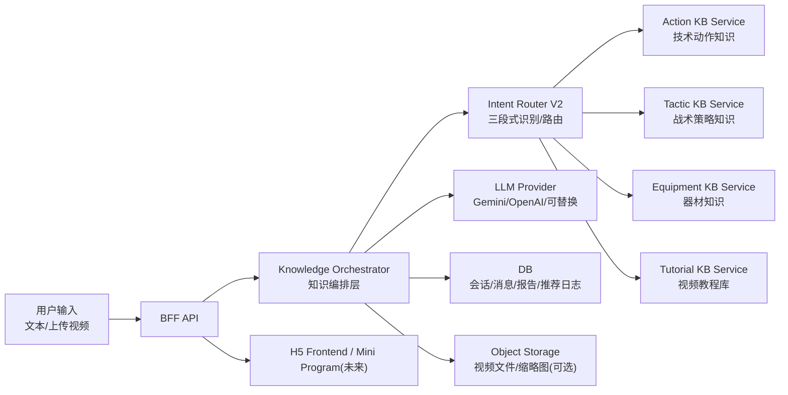

# Topstar 产品技术设计文档（Codex 版）

更新日期：2026-05-02  
状态：可落地（MVP -> 可演进生产级）  
范围：知识库系统 + 意图识别层重构 + 知识编排层 + 回复模板（结构化输出）+ 教程推荐 + 视频分析任务化 + 数据持久化 + 外链可用性治理 + 视频分析实现路径 + 推荐质量冷启动 + 统一化专家建议卡片 UI

**变更记录**

| 日期 | 版本 | 说明 |
|------|------|------|
| 2026-03-15 | v1.0 | 初版 |
| 2026-03-18 | v1.1 | 新增第 17 节（外链可用性治理）、第 18 节（视频分析实现路径）、第 19 节（推荐质量冷启动）；修正 `raw` 字段说明；更新分期计划 |
| 2026-03-19 | v1.2 | 基于 review 生成 v3 版修订：收紧外链状态语义、将视频分析 Phase 2 改为持久化任务、调整教程推荐为先召回后 rerank、补齐曝光埋点前提 |
| 2026-03-19 | v1.3 | 基于深度 review 补丁：修复推荐评分透明度（11节）、阶段A视频分析交互设计（18.2节）、外链状态机误杀问题（17.2节）、补全 enqueue MVP 实现（新增20节）、补充统一错误响应规范（9节）、补充并发写入保护方案（10节）、修正 confidence 阈值校准说明（5.3节）、补充教程库内存迁移触发条件（10.1节）、更新 Gemini 模型版本说明（18.2节）、补充 raw 字段用途说明（4.4节）、外链健康检查速率控制（17.2节）、补全第16节预留说明、修复文档末尾 TODO 格式 |
| 2026-03-22 | v1.4 | 基于 UI 体验反馈优化：新增 8.2 节（统一化专家建议卡片 UI 规范），明确技术动作问答场景下文字建议与视频教程的视觉聚合要求，解决 Markdown 符号冗余显示问题。 |
| 2026-03-22 | v1.5 | 补全 VIP 内容内容安全设计：新增 7.4 节（VIP 内容服务端脱敏），明确服务端对 `【核心秘诀】` 的物理隔离要求。 |
| 2026-03-22 | v1.6 | 补全 VIP 前端交互设计：新增 8.2.4 节（Frontend VIP Content Rendering & UX），明确“诱惑性设计”与“转化路径”的前端实现要求任务。 |
| 2026-04-19 | v1.7 | 新增第 21 节（视频教程库：离线同步与自动化更新）；记录 `syncTutorials.ts` 同步逻辑及基于 `node-cron` 的周级自动化更新机制。 |
| 2026-05-02 | v1.8 | 基于意图识别层重构提案 (intent_design_v2.md) 升级：引入多层意图结构 (Domain/Task/Response Mode)、增强型 Entities、三段式识别流程及 Policy 修正层。 |
| 2026-05-19 | v1.9 | 新增第 18.5 节前端视频处理与播放设计，定义首帧自动提取与本地 Blob 即时播放。 |
| 2026-06-08 | v1.10 | 修复视频分析上游污染问题：彻底阻断 Pass 1 片段描述（如"正手击球练习"）流入后续的技术分类（Pass 1.5）和诊断（Pass 2）阶段，消除模型锚定效应导致错判的隐患。 |

---

## 0. 背景与现状（基于当前代码库）

Topstar 当前形态是一个移动端 H5（React + Vite）+ 轻量 BFF（Express）：

- 前端通过 `/api/v1/ai/chat` 获取 AI 文本回复，并渲染结构化样式（`【...】` 标题、VIP 区块遮罩、TTS 播放等）。
- 服务端对本地知识库（`client/src/assets/knowledge/*.md`）做关键词检索，将命中内容拼接到 `systemInstruction` 再调用模型。
- “上传视频分析”的核心报告结果当前仍是前端模拟（`setTimeout` + mock report），没有真实的视频分析链路。

本设计文档的目标是：把“知识库系统 + 意图识别 + 回复模板 + 教程推荐 + 视频分析”统一成一个可维护、可扩展、可持续迭代的生产级架构，同时保持当前产品体验不被推翻重来。

---

## 1. 目标与非目标

### 1.1 目标（我们要交付什么）

1. **统一知识系统**：技术动作、战术策略、器材、视频教程都纳入统一知识服务，但保持域内模型/数据结构的差异化（不一锅炖）。
2. **可控意图识别**：把“用户问题属于哪类需求（动作/战术/器材/教程/视频分析）”变成可观察、可回归的逻辑，而不是完全交给模型自由发挥。
3. **知识编排层落地**：把“要检索哪些库、拿哪些上下文、怎么组装输出、如何降级”集中在服务端编排层，避免逻辑分散在 prompt/前端/mock。
4. **结构化输出协议**：服务端返回结构化 JSON（文本 + 报告 + 教程列表 + 引用），前端稳定渲染；同时维持现有 `【...】` 样式文本兼容。
5. **教程推荐真实化**：把“视频教程链接推荐”从“模型编造/前端 mock”改成来自你的收藏视频教程库（B 站/抖音链接集合）。
6. **视频分析任务化**：上传视频 -> 生成 analysis job -> 异步处理 -> 回传报告（可轮询/长轮询/后续可 SSE）。
7. **持久化与可观测性**：会话、消息、报告、推荐结果、token 使用量可记录；服务端可做审计、限流、错误码。
8. **Policy 层落地**：将业务策略（如“只要资源，不要讲解”）从 Prompt 剥离到代码逻辑中，确保输出稳定性。

### 1.2 非目标（当前不做）

- 不在 MVP 阶段引入复杂的向量数据库或大规模 RAG 体系（可留扩展点）。
- 不在 MVP 阶段实现完整的用户/支付/VIP 商业化闭环（只做必要的鉴权与分级能力）。
- 不在 MVP 阶段把外链视频“搬运/转码/托管”到自有 CDN（先做外链资产化与可用性治理）。

---

## 2. 术语与核心概念

- **知识域（Knowledge Domain）**：技术动作、战术策略、器材、教程视频四个域。
- **知识资产（Knowledge Asset）**：一个可被检索、可被引用的内容单元（如一篇动作 `.md`、一条教程视频元数据）。
- **意图 (IntentDecision)**：升级后的四层结构，包含领域、任务、响应模式与实体。
- **领域意图 (Domain Intent)**：用户问题所属的知识领域（如 ACTION, EQUIPMENT）。
- **任务意图 (Task Intent)**：用户希望系统执行的具体动作（如 EXPLAIN, RECOMMEND, TUTORIAL）。
- **响应模式 (Response Mode)**：最终交付给用户的界面形态（如仅文本、资源列表、诊断卡片）。
- **编排层（Orchestrator）**：一个服务端入口，负责预处理、意图路由、检索、上下文组装、调用模型、后处理、降级与输出协议。
- **输出模板（Template）**：规范化输出结构，保证前端可渲染、用户可读、可测试。
- **Policy 层**：位于模型识别之后、业务逻辑之前的确定性规则层，负责将业务约束强制落地。

---

## 3. 总体架构

### 3.1 逻辑架构



### 3.2 MVP 物理部署

- 前端：Vite 静态资源（H5）。
- 后端：Node.js（Express）BFF。
- 数据：MVP 可用 SQLite（或直接 JSON + 文件），生产建议 PostgreSQL。
- 文件：视频上传先用对象存储（S3/R2/OSS），MVP 可先落本地磁盘（仅开发环境）。

---

## 4. 知识系统设计（四个域）

### 4.1 技术动作知识库（Actions）

**载体**：Markdown（保留现状，便于迭代）。  
**索引**：`index.json` + metadata（title/category/keywords）。  
**主键**：`action_id`（例如 `bh_flick`, `fh_loop`）。  
**用途**：

- 作为动作问答的“权威上下文”注入给模型。
- 作为报告卡片的“动作要领/常见问题/训练建议”来源。
- 作为教程推荐的锚点（教程视频关联到 `action_id`）。

**范例（MVP 建议保持与现状兼容）**：

动作索引条目（示例，来源于 `client/src/assets/knowledge/index.json` 的结构）：

```json
{
  "id": "bh_flick",
  "title": "反手拧拉",
  "category": "actions",
  "file": "actions/bh_flick.md",
  "keywords": ["拧拉", "反手拧", "台内拧", "张继科拧拉", "架肘"]
}
```

动作知识文件片段（示例，`actions/bh_flick.md` 风格）：

```md
### 【动作要领】
引拍时前臂外旋，拍头略高于手腕；击球点在身体前侧，向前上摩擦为主。

### 【常见问题】
1) 只“甩手腕”不蹬转，球缺底劲
2) 拍型过亮，容易出界

### 【训练建议】
多球：短下旋到反手位，先做薄摩擦，再逐步提速；要求每板击球点一致。
```

### 4.2 战术策略知识库（Tactics）

**载体**：Markdown（可保留现状）。  
**主键**：`tactic_id`（可从现有文件 id 推导）。  
**用途**：

- 解决“实战表现 -> 战术建议”的映射。
- 可直接为模型提供“策略映射矩阵”上下文。

**范例（战术映射条目片段）**：

```md
## 【表现与策略映射矩阵】

现象：被对方反手大角长球顶住
定性：节奏被压制，挥拍空间被挤压
建议（对自己）：别往后躲，球一起跳就迎上去，借力带回去
建议（对对手）：继续追身长球，限制引拍空间
```

### 4.3 器材知识库（Equipment）

**载体**：Markdown/结构化（MVP 可沿用 Markdown）。  
**主键**：`equipment_id`（如 `rubber_d09c`）。  
**用途**：

- 器材问答与推荐，需要更结构化输出（性能特点/适合打法/价格区间）。

**范例（器材条目，Markdown 承载结构化字段）**：

```md
## 【性能特点】
粘性套胶，台内小球控制稳定；发力后底劲强，容错高。

## 【适合打法】
发力出色的进攻型选手

## 【代表运动员】
樊振东、奥恰洛夫

## 【价格区间】
390-490 元
```

### 4.4 视频教程知识库（Tutorials）

这是本次落地的关键新增域。

**数据来源**：你长期收藏整理的抖音/B 站链接集合（网页可访问链接）。  
**MVP 目标**：让系统能可靠地回答：

- “给我一个反手拧拉视频教程”
- “动作分析报告卡片里的视频教程推荐（真实链接）”

**建议资产化字段（最少集）**：

- `tutorial_id`: 全局唯一（建议 `platform:item_id`）
- `platform`: `bilibili` / `douyin`
- `platform_item_id`: bvid/aweme_id/或平台 ID
- `title`
- `url`
- `author`（可空）
- `source_folder_title`（来自收藏夹分类，用于标签）
- `tags`: `["拧拉","接发球","台内"]`（可自动 + 人工修订）
- `related_action_ids`: `["bh_flick"]`（强关联，最重要）
- `related_tactic_ids`: 可选
- `quality_score`: 可选（先手工少量标注也行）
- `status`: `active|dead|suspect`
- `last_verified_at`: 可选

**注意**：教程库是“资源层”，不替代动作/战术/器材的解释层。动作/战术/器材给“怎么做/为什么”，教程给“看什么学”。

**范例（教程资产记录，建议先用 JSON 文件加载到内存）**：

建议存放位置（MVP）：`server/data/tutorials.json`

```json
[
  {
    "tutorial_id": "bilibili:BV1SHzeBCEXX",
    "platform": "bilibili",
    "platform_item_id": "BV1SHzeBCEXX",
    "title": "接发球-高阶版：一个视频精通推挑",
    "url": "https://www.bilibili.com/video/BV1SHzeBCEXX",
    "author": "某某教练",
    "source_folder_title": "乒乓_推挑",
    "tags": ["推挑", "接发球", "短球"],
    "related_action_ids": [],
    "related_tactic_ids": [],
    "quality_score": 2,
    "status": "active",
    "last_verified_at": "2026-03-01"
  },
  {
    "tutorial_id": "bilibili:BV1f96VYyEh3",
    "platform": "bilibili",
    "platform_item_id": "BV1f96VYyEh3",
    "title": "张继科教你霸王拧：台内拧拉关键细节",
    "url": "https://www.bilibili.com/video/BV1f96VYyEh3",
    "author": "张继科",
    "source_folder_title": "乒乓_拧拉",
    "tags": ["拧拉", "反手拧", "台内", "接发球"],
    "related_action_ids": ["bh_flick"],
    "related_tactic_ids": [],
    "quality_score": 3,
    "status": "active",
    "last_verified_at": "2026-03-10"
  }
]
```

---

## 5. 意图识别层重构 (Intent & Router V2)

### 5.1 结构化意图协议 (IntentDecision)

Phase 2 将意图识别从“领域分类”升级为“结构化请求理解”，采用四层架构：

```ts
interface IntentDecision {
  domain_intent: 'ACTION' | 'TACTIC' | 'EQUIPMENT' | 'VIDEO_ANALYSIS' | 'GENERAL_PINGPONG' | 'OFF_TOPIC';
  task_intent: 'EXPLAIN' | 'DIAGNOSE' | 'RECOMMEND' | 'COMPARE' | 'TUTORIAL' | 'PLAN' | 'QA';
  response_mode: 'TEXT_ONLY' | 'TEXT_WITH_RESOURCES' | 'RESOURCE_ONLY' | 'REPORT_CARD' | 'COMPARISON_CARD' | 'QUESTION_BACK';
  entities: {
    action_id: string | null;
    equipment_query: string | null;
    tactic_topic: string | null;
    comparison_targets: string[];
    budget: string | null;
    player_profile: string | null;
    needs_tutorials: boolean;
    needs_explanation: boolean;
    needs_recommendation: boolean;
  };
  confidence: number;
  source: 'rule' | 'llm' | 'policy' | 'fallback';
  reason?: string;
}
```

### 5.2 三段式识别流程

1. **Stage A：强规则预判**
   - 识别高精度强约束（如上传视频事件、明确要求“只要链接”）。
   - 规则层只做拦截和强标记，不承担复杂语义分类。
2. **Stage B：LLM 结构化理解**
   - 模型输出 `IntentDecision` JSON 结构。
   - 模型职责从“选大类”变为“解析槽位”与“理解交付偏好”。
3. **Stage C：Policy 修正层**
   - 业务逻辑硬核矫正。例如：命中“不用讲解”关键词，则强制设置 `response_mode = RESOURCE_ONLY`。
   - 实现“业务逻辑代码化”，减少通过 Prompt 控制模型的随机性。

### 5.3 降级与评估策略

- **分层降级**：
    - 一级：保守输出（分类不稳定时，返回中性说明，禁止强行进入教学模板）。
    - 二级：最小损害渲染（`response_mode` 不确定时，优先 `TEXT_ONLY`）。
    - 三级：记录反馈（高风险样本记入 `intent_eval_set`，不进行猜测）。
- **置信度校准**：不应硬编码固定经验值，而应通过 `intent_eval_set.jsonl`（50-200 条）跑离线评估，找到准确率拐点作为动态阈值。

---

## 6. 知识编排层（Orchestrator V2）

编排层逻辑从“按 Intent 路由”升级为“按 IntentDecision 编排”。

### 6.1 编排控制点

- **检索控制**：根据 `domain_intent` 决定检索哪些知识库。
- **内容注入**：根据 `needs_explanation` 决定是否注入完整知识正文作为上下文。
- **推荐策略**：根据 `task_intent` 决定是否调用教程推荐算法或对比分析算法。
- **输出模板**：根据 `response_mode` 决定最终返回给前端的 UI 数据结构。

### 6.2 视频分析任务化流程

1. `POST /api/v2/analysis/jobs`：创建任务（返回 job_id）。
2. `PUT /api/v2/analysis/jobs/{id}/upload`：上传视频或提交已上传 URL。
3. 后端异步执行分析（持久化队列，详见第 18、20 节）。
4. `GET /api/v2/analysis/jobs/{id}`：前端轮询状态与最终报告。

---

## 7. 输出协议（Response Contract）与回复模板（Templates）

### 7.1 为什么要结构化协议

仅返回一段文本会导致：

- 教程链接只能靠模型“记得写对链接”
- 报告卡片只能靠模型“写成你想要的结构”
- 任何 UI 想升级都要改 prompt 并赌模型稳定性

所以建议服务端返回结构化 JSON，前端渲染更稳定。

### 7.2 `ChatResponse` V2 (建议)

```json
{
  "success": true,
  "answerText": "第一行一句总结...\n\n【动作要领】...\n",
  "intent_decision": { ... },
  "references": [
    { "type": "action_doc", "id": "bh_flick", "title": "反手拧拉" }
  ],
  "tutorialVideos": [
    { "tutorial_id": "bilibili:BV1xxx", "title": "张继科教你霸王拧", "url": "https://www.bilibili.com/video/BV1xxx", "platform": "bilibili" }
  ],
  "report": null,
  "meta": {
    "request_id": "uuid",
    "cost": { "input_tokens": 0, "output_tokens": 0 },
    "degraded": false
  }
}
```

### 7.3 响应模式与模板对齐

- **RESOURCE_ONLY**：文本回答极简（1句导语），核心内容在 `tutorialVideos` 列表中展示。
- **TEXT_WITH_RESOURCES**：导语 + 知识要点 + 教程列表。
- **REPORT_CARD**：由 `DIAGNOSE` 任务触发，返回结构化 `report` 数据。
- **COMPARISON_CARD**：由 `COMPARE` 任务触发，用于器材对比。

#### A) 动作类（ACTION_COACHING）

- 必须包含：`【动作要领】`、`【常见问题】`、`【训练建议】`、`【视频教程】`
- `【视频教程】` 的链接优先来自 `tutorialVideos`，文本中若无可用链接则输出“暂无匹配的视频教程”
- `【核心秘诀(VIP专属)】` 作为可选段（由服务端权限决定是否下发完整内容）

#### B) 战术类（TACTIC_ADVICE）

- 必须包含：`【存在问题/定性分析】`、`【改进建议/实战策略】`
- 总字数约束由服务端做后处理截断/提示，不完全依赖模型自觉

#### C) 器材类（EQUIPMENT_QA）

- 必须包含：`【性能特点】`、`【适合打法】`、`【代表运动员】`、`【价格区间】`
- 推荐方案需要先补问关键条件（打法/预算/咨询品类）

#### D) 教程请求（TUTORIAL_REQUEST）

- 文本回答极简：给 1 句为什么推荐 + 1-3 个链接
- 真正的链接以 `tutorialVideos` 数组为准

#### E) 视频分析（VIDEO_ANALYSIS）

- `report` 字段返回结构化 `AnalysisReport`（见下节）
- 同时可给简短 `answerText` 作为摘要

### 7.4 VIP 内容服务端脱敏 (Server-side VIP Desensitization)

为了防止非 VIP 用户通过查看网络请求（Network Tab）获取 `【核心秘诀】` 后的明文内容，编排层需在输出前执行物理隔离：

#### 7.4.1 脱敏触发条件
- 当后端识别到用户为非 VIP 身份（或 `is_vip: false`）时触发。
- 适用于两类风险：
  1. 知识库原文中显式存在 `【核心秘诀】` / `【VIP专属】` 区块。
  2. 模型将 VIP 内容改写后混入 `【动作要领】`、`【常见问题】`、`【训练建议】` 等普通段落。

#### 7.4.2 安全目标
- **响应体零明文**：对非 VIP 用户，最终下发给前端的响应 JSON 中，不得包含任何 VIP 明文，不得依赖前端遮罩来“隐藏已泄露内容”。
- **服务端收口**：VIP 内容权限控制以服务端最终输出为准；前端的 Blur/锁头/禁止复制仅作为 UX 与防御性增强，不作为安全边界。
- **结构稳定**：若命中的知识条目存在 VIP 内容，非 VIP 响应必须保留可识别的锁定结构，以便前端稳定渲染锁区。

#### 7.4.3 实现逻辑
- **入模前物理剥离**：在知识库命中后、拼接 `systemInstruction` 前，先移除原始知识中的 `【核心秘诀】` / `【VIP专属】` 正文，避免模型直接读取 VIP 明文。
- **输出后最终脱敏**：在模型生成 `answerText` 之后、返回前再执行一次响应级清洗。若模型把 VIP 内容混写进普通段落，服务端必须继续裁剪或替换，直到响应体中不再包含 VIP 明文。
- **优先保守，不做猜测展示**：当服务端判断“该回答命中了带 VIP 区块的知识”，但又无法百分百确认普通段落中的某句话是否属于 VIP 改写内容时，应优先删除可疑片段或退化为统一占位，而不是冒险保留。
- **保留锁定结构**：非 VIP 场景下，必须保留标题头（如 `【核心秘诀(VIP专属)】` 或统一化的 `【核心秘诀】`），并将正文替换为系统占位符（例如：`[LOCKED_VIP_CONTENT]`），以便前端稳定触发“毛玻璃/锁头”视觉反馈。
- **占位符协议固定**：`[LOCKED_VIP_CONTENT]` 仅作为服务端到前端之间的内部锁定协议，不属于用户可见文案。前端渲染层必须消费该占位符并转化为锁卡 UI，严禁将其作为正文直接展示给用户。
- **协议优先于文案**：前端应依赖服务端定义的锁定结构 or 占位符渲染锁区，不应依赖模型是否“恰好”按模板生成了独立的 VIP 标题块。

#### 7.4.4 兜底保护
- **TTS 过滤**：服务端在生成 TTS 预读取文本时，必须同步剔除 VIP 段落，防止通过语音合成接口窃取内容。
- **链路一致性**：所有对外聊天入口（`/api/v1/ai/chat`、`/api/v2/chat` 或兼容旧链路）都必须执行同一套 VIP 脱敏策略，禁止出现“新链路安全、旧链路泄露”的情况。
- **权限透传**：前端调用聊天接口时，必须显式透传用户权限信息（如 `prefs.is_vip` 或 `UserContext.tier`），禁止服务端在缺失权限上下文时默认返回完整 VIP 内容。
- **日志审计**：记录脱敏触发事件，用于后续商业转换率分析。

---

## 8. `AnalysisReport` 数据模型（前端报告卡片对齐）

沿用当前前端 `AnalysisReportCard` 需要的结构（并扩展字段）：

```json
{
  "techName": "正手拉球技术指导",
  "variant": "gradient",
  "problems": [
    { "text": "重心交换不足，底劲不够。", "timestamp": "00:04" }
  ],
  "improvements": [
    "加强下肢蹬转训练...",
    "练习拉下旋时从后中下部向上摩擦..."
  ],
  "videoLinks": [
    { "title": "樊振东正手拉球慢动作示范", "url": "https://www.bilibili.com/video/BV1xxx" }
  ]
}
```

其中 `videoLinks` 不再来自前端 mock，而是来自教程库推荐服务。

`techName` 命名规则需与场景保持一致：
- **自由问答 / ACTION_COACHING**：优先使用 `{动作名}技术指导`；若当前轮次无法稳定提取动作名，则退化为 `技术动作指导`。
- **视频上传 / VIDEO_ANALYSIS**：使用 `技术动作诊断报告`，或在识别到明确动作名时使用 `{动作名}技术诊断报告`。
- 禁止在纯文字问答场景下统一使用 `技术动作诊断报告`，以免给用户造成“已完成视频诊断”的误解。

### 8.2 统一化专家建议卡片 (Unified Coaching Card UI)

为了提供更显专业感和一体化的用户体验，针对 `ACTION_COACHING` 意图，UI 渲染需遵循以下规范：

#### 8.2.1 视觉聚合（Visual Aggregation）
- **杜绝分散**：严禁将 AI 文本建议与推荐视频分为两个独立的气泡展示。
- **一体化封装**：将 `answerText`（AI 综述）与 `tutorialVideos`（视频列表）聚合在同一个 `AnalysisReportCard` 或专门的诊断卡片中。
- **标题语义准确**：卡片标题必须与内容来源一致。自由问答场景使用“技术指导”语义；仅在视频分析结果场景使用“诊断报告”语义。
- **层次结构**：
    1. **顶部**：展示 AI 生成的综合诊断总结（`answerText`）。
    2. **中部**：按需展示结构化要领（若 `answerText` 未包含，可从知识库解析补全）。
    3. **底部**：无缝衔接推荐的视频教程（`动作示范` / `视频教程` 区域）。
    4. **VIP Block**：若 `answerText` 中存在 `【核心秘诀】` 区块，则其在卡片内的显示顺序必须位于视频教程之后，与知识库的内容组织顺序保持一致；不得提前插入到视频列表上方。

#### 8.2.2 文本脱敏与清洗
- **Markdown 符号屏蔽**：后端生成的 `answerText` 必须为纯净文本或仅含系统定义的 `【标题】`。
- **前端防御性渲染**：渲染组件需具备“自动清洗”能力，剔除所有残留的 Markdown 符号（如 `**`、`###`、`*` 等），改为使用卡片内部的主题样式（如 `primary` 色的 bullet points）进行渲染。

#### 8.2.3 VIP 卡片遮罩语义（VIP Card UX）
- 对非 VIP 用户，`AnalysisReportCard` 中的 `【核心秘诀】` 区域需触发特殊的锁定态渲染（毛玻璃 + 锁头图标 + 引导升级文案），而不是仅显示 `[LOCKED_VIP_CONTENT]` 占位符。

#### 8.2.4 Frontend VIP Content Rendering & UX

当 `answerText` 或 `report` 字段中包含 `[LOCKED_VIP_CONTENT]` 占位符时，前端 React 组件必须执行以下逻辑，确保“诱惑性设计”与“转化路径”：

1.  **标识检测**：
    *   在渲染 `AnalysisReportCard` 或普通消息气泡时，正则扫描内容流中的 `[LOCKED_VIP_CONTENT]` 占位符及其关联的标题（如 `【核心秘诀】`）。
2.  **视觉锁定 (Blur & Lock)**：
    *   将该区块对应的正文替换为**三行随机模糊的“占位线条”**或**带毛玻璃效果的 Mock 文本**（例如：`Lorem ipsum dolor sit amet...` 且 `filter: blur(5px)`）。
    *   在模糊区域正上方覆盖一个居中的**锁头图标 (Locked Icon)**。
3.  **转化引导 (CTA - Call to Action)**：
    *   在锁头图标下方显示醒目的引导文案，如：`【解锁核心秘诀】加入顶级会员，获取专家级细节指导`。
    *   提供一个点击可跳转或弹窗的按钮/链接，引导至会员说明页。
4.  **物理安全兜底**：
    *   严禁将 `[LOCKED_VIP_CONTENT]` 字样直接展示给最终用户。
    *   严禁通过前端代码在 DOM 中恢复被模糊的内容（因为服务端下发的本身就是 Mock 占位符，实现了物理隔离）。
5.  **交互反馈**：
    *   当非 VIP 用户点击该区域时，触发震动反馈（Haptic Feedback，若在小程序/App内）或轻微的抖动动效，提示需解锁。

---

## 9. API 设计

### 9.1 Chat API (V2)

`POST /api/v2/chat`

**输入**：
- `message`: string
- `history`: Array<{role, content}>
- `prefs`: { is_vip: boolean, ... }

**输出**：见 7.2 节。

**错误处理**：
统一使用 JSON 响应：`{ success: false, error: { code: string, message: string } }`。常见代码：`RATE_LIMIT`, `LLM_TIMEOUT`, `KNOWLEDGE_NOT_FOUND`。

### 9.2 Analysis Job API

见 6.2 节。

---

## 10. 数据持久化（Persistence）

### 10.1 存储选型
- 会话与消息：SQLite (WAL 模式)。
- 任务队列：SQLite 表 `analysis_jobs`。
- 教程库：
  - 加载：启动时将 `tutorials.json` 加载至内存 Map（提升检索效率）。
  - 迁移：当数据规模超过 1 万条或出现多进程扩容需求时，迁移至 PostgreSQL。

### 10.2 核心表（建议）：

- `users`
- `chat_sessions`
- `chat_messages`
- `analysis_jobs`
- `analysis_reports`
- `tutorial_videos`
- `tutorial_relations`（tutorial <-> action/tactic 的关系）
- `usage_events`（token、耗时、错误码、推荐点击等）

### 10.3 并发写入保护

`tutorial_videos` 表存在多路并发写入场景，需明确保护策略：

| 写入来源 | 触发时机 | 写入字段 | 冲突风险 |
|----------|----------|----------|---------|
| `link-health-check` 定时 Job | 每天凌晨 | `status`, `last_checked_at`, `consecutive_failures` | 与用户上报并发 |
| 用户 `report-dead` 上报 | 实时 | `status`, `failure_reported_by_user` | 与定时 Job 并发 |
| `bootstrap_quality_scores` 冷启动 | 一次性 | `quality_score`, `score_source` | 与点击率调权并发 |
| 点击率调权定期 Job | 每周 | `quality_score`, `click_count`, `impression_count` | 与上述两项并发 |

**SQLite MVP 方案**：SQLite 单写者模型下，并发写入会直接报 `SQLITE_BUSY`。建议：
```typescript
// 所有写入通过统一的串行写队列，避免并发冲突
// 使用 better-sqlite3 的同步 API + WAL 模式
import Database from 'better-sqlite3';
const db = new Database('topstar.db');
db.pragma('journal_mode = WAL');   // WAL 模式允许并发读，写仍串行
db.pragma('busy_timeout = 3000');  // 写锁等待最多 3 秒再报错

// 批量更新用事务包裹，提升效率并保证原子性
const updateBatch = db.transaction((updates: TutorialUpdate[]) => {
  const stmt = db.prepare(
    'UPDATE tutorial_videos SET status=?, consecutive_failures=?, last_checked_at=? WHERE tutorial_id=?'
  );
  for (const u of updates) stmt.run(u.status, u.consecutiveFailures, u.lastCheckedAt, u.tutorialId);
});
```

**PostgreSQL 生产方案**：使用乐观锁（`version` 字段）或行级锁（`SELECT ... FOR UPDATE`），点击率调权 Job 使用 `UPDATE ... WHERE quality_score = $old_score`（CAS 语义），冲突时跳过该条目并记录日志。

---

## 11. 教程库检索与推荐（MVP 实现策略）

先稳后强，MVP 推荐规则：

1. 如果意图/实体解析出 `action_id`：
   - 优先按 `related_action_ids` 精确匹配
2. 否则：
   - 用 `tags/title/source_folder_title` 做关键词匹配（可加权）
3. 排序（先召回候选，再综合评分 rerank）：
   - 相关性分（`scoreCandidate`，见下方实现）权重最高
   - `status`（`active` 优先于 `suspect`）
   - `quality_score` 作为 rerank 修正项（乘以系数 0.3，避免质量分压过相关性）
   - 最近验证时间（若做可用性检查）

**`scoreCandidate()` 参考实现**（与 `recommendTutorials()` 配套，保证评分量级透明）：

```typescript
// server/tutorials/scoreCandidate.ts

export function scoreCandidate(tutorial: Tutorial, tags: string[]): number {
  let score = 0;

  // 1. action_id 精确命中：最高权重（与 quality_score 满分相当，确保相关性压过质量分）
  // action_id 命中 +5，quality_score 满分 ~6 * 0.3 = 1.8，status active +1
  // 所以 action 命中的最低分（5.0）仍高于无 action 命中的最高分（1.0 + 1.8 = 2.8）
  const actionMatched = tutorial.related_action_ids?.some(id =>
    tags.includes(`action:${id}`)   // tags 调用时传入 ['action:bh_flick', ...]
  );
  if (actionMatched) score += 5;

  // 2. tag 命中数：每个命中 +0.5，上限 +2
  const tagHits = tags.filter(t => tutorial.tags?.includes(t)).length;
  score += Math.min(tagHits * 0.5, 2);

  // 3. 标题关键词命中：+0.5（粗粒度，标题未必含精确词）
  const titleHit = tags.some(t => tutorial.title?.includes(t));
  if (titleHit) score += 0.5;

  return score;
}
```

评分量级预期（便于调试和后续调整）：

| 场景 | 相关性分 | status 分 | quality 分 | 合计估算 |
|------|----------|-----------|------------|---------|
| action 精确命中 + active + 高 quality | 5.0 | 1.0 | ~1.8 | ~7.8 |
| action 精确命中 + suspect + 低 quality | 5.0 | 0 | ~0.3 | ~5.3 |
| 仅 tag 命中（2个）+ active + 中 quality | 1.0 | 1.0 | ~0.9 | ~2.9 |
| 无关联 + active + 高 quality | 0 | 1.0 | ~1.8 | ~2.8 |

这样保证：**有 action 关联的相关教程，无论质量分高低，总排在无 action 关联教程之前**。

后续增强（可选）：

- embedding 语义检索（统一检索动作/战术/教程）
- 引入“学习路径”推荐（同一动作按入门->进阶排序）

**范例（一次完整推荐的输入与输出）**：

输入（用户）：

```text
反手拧拉怎么练？给我一个视频教程
```

编排层中间结果（示例）：

```json
{
  "intent": "ACTION_COACHING",
  "entities": { "action_id": "bh_flick" },
  "kb_hits": [{ "type": "action_doc", "id": "bh_flick", "title": "反手拧拉" }]
}
```

教程推荐输出（示例，返回 2 条）：

```json
[
  {
    "tutorial_id": "bilibili:BV1f96VYyEh3",
    "title": "张继科教你霸王拧：台内拧拉关键细节",
    "url": "https://www.bilibili.com/video/BV1f96VYyEh3",
    "platform": "bilibili"
  },
  {
    "tutorial_id": "bilibili:BV1xxxxxxx",
    "title": "反手拧拉发力与击球点讲解（慢动作）",
    "url": "https://www.bilibili.com/video/BV1xxxxxxx",
    "platform": "bilibili"
  }
]
```

---

## 12. 安全、成本与可观测性

### 12.1 安全

- API Key 只在服务端（已做到），前端永不持有。
- 加入基础鉴权（MVP 可用匿名 session + server-side rate limit）。
- 输出过滤：严格限制外链来源（教程链接只来自教程库，不允许模型自由造链接）。

### 12.2 成本

- 编排层控制上下文长度：只注入 Top-K 知识条目 + Top-3 教程。
- 记录每次请求 token 使用（用于配额与调优）。

### 12.3 可观测性

- 每个请求生成 `request_id`，记录：intent、命中知识、命中教程、耗时、错误码。
- analysis job 记录状态机与失败原因，便于排查。

---

## 13. 分期实施计划 (Phase 2 全量版)

### Phase 1（1-2 周）：把"教程推荐 + 结构化输出"落地

**核心任务**：
- 服务端新增教程库加载与 `recommendTutorials()`
- 新增 `/api/v2/chat` 返回结构化 JSON（兼容旧文本）
- 前端从 `tutorialVideos` 渲染报告卡片 `videoLinks`（先接入文本问答场景）

**配套（来自第 17、19 节，Phase 1 必须一并做）**：
- `recommendTutorials()` 里加 `status !== 'dead'` 过滤（第 17.2 节）
- 运行 `bootstrap_quality_scores.ts` 冷启动脚本（第 19.2 节），推荐排序改为按 `quality_score DESC`
- 部署 `link-health-check` 定期 Job（第 17.2 节）

验收：
- 问"反手拧拉怎么练/给我视频教程"能返回真实链接
- 模型不再编造链接
- 死链不出现在推荐结果里
- 教程推荐有明显的质量排序差异（有 action 关联的排在前面）

### Phase 2-A：视频分析任务化 (1-2 周)
- [ ] **P2-D1** 创建 `analysis_jobs` 表。
- [ ] **P2-S1** 实现 `AnalysisWorker` 轮询处理逻辑。
- [ ] **P2-S2** 实现阶段 A 处理器（基于用户描述生成诊断）。
- [ ] **P2-F1/F2** 前端适配任务状态轮询与结果渲染。

### Phase 2-B：意图识别层重构 (1-2 周)
- [ ] **P2-I1** 实现 `IntentDecision` Schema 及接口定义。
- [ ] **P2-I2** 升级三段式识别流程 (Stage A/B/C)。
- [ ] **P2-I3** 建立 Policy 层框架，处理“只要资源”硬规则。
- [ ] **P2-I4** 构建 50+ 样本的回归测试集进行校准。
- [ ] **P2-F4** 前端适配 `response_mode` 渲染逻辑。

### Phase 3（持续）：视频真实理解 + 语义检索 + Mini Program 适配

- 视频分析切换至**阶段 B 实现**（第 18.2 节）：接入 Gemini Files API 真正看视频
- embedding/语义检索统一化（可选）
- PostgreSQL + Prisma
- 定期点击率调权 Job，持续优化推荐质量（第 19.3 节）
- 小程序端只换 UI，复用同一 BFF API

---

## 14. 风险与应对

1. 外链不稳定（抖音/B站）
   - 详细解决方案见第 17 节（外链可用性治理）
   - 简述：定期探测 Job + 推荐过滤 + 用户失效上报三层治理
   - 中间跳转页（保留产品上下文 + 统计点击）
2. 模型不遵守模板
   - 服务端做模板校验与降级（缺字段则补"暂无/待补充"）
3. 现有前端依赖浏览器能力（语音/iframe）
   - 结构化输出协议优先，小程序迁移时替换能力模块即可
4. 视频分析实现路径不清晰（新增）
   - 详细解决方案见第 18 节（视频分析实现路径）
   - 简述：阶段 A（基于文字描述）-> 阶段 B（Gemini Files API 真实视频）渐进切换
5. 教程推荐质量因 quality_score 缺失而打折（新增）
   - 详细解决方案见第 19 节（推荐质量冷启动）
   - 简述：结构化信号冷启动自动评分 + 点击率持续调权
---

## 15. 附录：推荐的服务端模块拆分（目录建议）

MVP 先不追求框架升级，但建议按模块拆开：

- `server/orchestrator/`
  - `handleChatEvent()`
  - `handleAnalysisJob()`
- `server/knowledge/`
  - `actions.ts`
  - `tactics.ts`
  - `equipment.ts`
- `server/tutorials/`
  - `loadTutorials()`
  - `recommendTutorials()`
- `server/templates/`
  - 各 intent 的模板约束与校验

---

## 16. 扩展点预留（Extension Hooks）

> 本节为预留章节，记录当前 MVP 阶段有意推迟但需要保持扩展点的设计决策，避免后续迭代被迫重构核心链路。

| 扩展点 | 当前做法 | 预留方式 | 触发迁移条件 |
|--------|----------|----------|------------|
| 向量检索 / RAG | 关键词倒排 + tag 匹配 | `KnowledgeService` 接口抽象，内部可替换实现 | 知识库规模超过 5 万条，或关键词召回准确率低于 60% |
| 用户/支付/VIP 商业化 | session 匿名 + 能力分级占位 | `UserContext` 携带 `tier` 字段，编排层按 tier 决定是否下发完整内容 | 商业化排期启动 |
| 小程序端 | H5 | BFF API 保持平台无关，UI 层替换 | 小程序开发启动 |
| 视频 CDN 自托管 | 外链直跳 | `TutorialVideo.url` 字段可切换为内部 CDN URL，无需改检索逻辑 | 外链失效率持续超过 15% 或平台政策变化 |
| Embedding 语义检索 | 无 | 在 `recallTutorialCandidates()` 内部预留 `strategy` 参数（`keyword` / `embedding` / `hybrid`） | Phase 3 后期，搜索质量瓶颈出现 |

---

## 17. 外链可用性治理（Link Health Management）

### 17.1 问题背景

教程库中有约 4.8k 条去重后的抖音/B 站外链（原始来源记录 5k+），平台方随时可能下架或改变 URL 结构，`status` 和检查时间字段如果没有自动 enforcement，会迅速腐化成无效数据。用户侧的表现是：点击推荐链接 -> 404/空白页，信任感大幅受损。

### 17.2 解决方案：三层可用性治理

#### 层 1：定期探测 Job（离线）

在服务端新增一个定期运行的可用性检查脚本 `server/jobs/link-health-check.ts`，对教程条目做轻量探测，更新系统检查时间与状态：

```typescript
// server/jobs/link-health-check.ts

const CHECK_INTERVAL_DAYS = 7;   // 普通条目每 7 天检查一次
const DEAD_RETRY_DAYS     = 30;  // dead 条目每 30 天重新确认
const DEAD_THRESHOLD      = 3;   // 连续失败 3 次才升级为 dead（防止反爬/CDN 波动误杀）

async function checkOne(tutorial: Tutorial): Promise<'active' | 'suspect' | 'dead_confirmed'> {
  try {
    const res = await fetch(tutorial.url, {
      method: 'HEAD',
      redirect: 'follow',
      signal: AbortSignal.timeout(5000),
      headers: { 'User-Agent': 'Topstar-LinkBot/1.0' }
    });
    if (res.ok) return 'active';
    if (res.status === 404 || res.status === 410) return 'dead_confirmed';
    return 'suspect';   // 5xx / 403 / 其他 -> 暂标疑似，不直接宣判 dead
  } catch {
    return 'suspect';   // 超时 / 网络错误 -> 先标疑似，避免误杀
  }
}

async function runHealthCheck(tutorials: Tutorial[]) {
  const now = Date.now();
  for (const t of tutorials) {
    const lastCheck = t.last_checked_at ? new Date(t.last_checked_at).getTime() : 0;
    const staleDays = (now - lastCheck) / 86400000;
    const needsCheck = t.status !== 'dead'
      ? staleDays >= CHECK_INTERVAL_DAYS
      : staleDays >= DEAD_RETRY_DAYS;
    if (!needsCheck) continue;

    // 速率控制：每次请求之间随机 jitter，避免触发平台反爬封禁
    await sleep(200 + Math.random() * 300);  // 200-500ms 随机间隔

    const probe = await checkOne(t);
    const consecutiveFailures = (probe === 'suspect' || probe === 'dead_confirmed')
      ? (t.consecutive_failures ?? 0) + 1
      : 0;

    // 状态升级规则：
    // - active：重置失败计数
    // - suspect：累计失败，未达阈值前保持 suspect，达到阈值才升级为 dead
    // - dead_confirmed（404/410）：直接 + 连续失败累计，达阈值升级为 dead
    // 这样单次 404（可能是 CDN 抖动）不会立即宣判死链
    let newStatus: 'active' | 'suspect' | 'dead' = t.status as any;
    if (probe === 'active') {
      newStatus = 'active';
    } else if (consecutiveFailures >= DEAD_THRESHOLD) {
      newStatus = 'dead';
    } else {
      newStatus = 'suspect';
    }

    await db.tutorials.update(t.tutorial_id, {
      status: newStatus,
      last_checked_at: new Date().toISOString(),
      consecutive_failures: consecutiveFailures,
    });
  }
}
```

**触发方式（MVP 选其一）**：
- 本地/VPS：`node-cron` 每天凌晨 3 点执行（`0 3 * * *`）
- 云函数：Cloudflare Worker Cron / Vercel Cron Job，无需常驻进程

**速率控制（必须做）**：上面代码中每次请求之间加入 200-500ms 随机 jitter。如需更严格控制，可限制每批次最多处理 N 条（如 200 条），剩余留到次日，避免单次批跑触发平台封禁。

**注意**：抖音对爬虫 HEAD 有 403 拦截，实际探测时建议：
- B 站：HEAD 检查通常有效
- 抖音：改为 GET + 检查 `<title>` 是否含"找不到/已删除"关键词，或依赖用户反馈（见层 3）

**状态流转说明**（与代码逻辑对齐）：

```
active ──[探测失败]──> suspect ──[连续失败 ≥ 3 次]──> dead
  ^                      |
  └──[探测成功]──────────┘
dead  ──[30天后重探,探测成功]──> active
```

- 自动探测连续失败未达阈值：保持 `suspect`，仍参与推荐（降权）
- 连续失败 3 次（`consecutive_failures >= DEAD_THRESHOLD`）才升级为 `dead`，过滤出推荐池
- 人工确认或用户上报可直接跳转至 `dead`，不受阈值限制
- 避免因反爬/网络波动把正常链接误判为死链

#### 层 2：服务端推荐时过滤 + 降级

编排层 `recommendTutorials()` 必须过滤 `status === 'dead'` 的条目，并保持"先召回相关内容，再按质量/可用性重排"：

```typescript
// server/tutorials/recommendTutorials.ts

export async function recommendTutorials(
  actionId: string | null,
  tags: string[],
  limit = 3
): Promise<Tutorial[]> {
  // Step 1: 先按 action/tags/title 做召回，避免先按质量截断导致相关内容进不了候选集
  const candidates = await recallTutorialCandidates({
    actionId,
    tags,
    status: ['active', 'suspect'],
    take: limit * 10,
  });

  const scored = candidates.map(t => ({
    ...t,
    _score: scoreCandidate(t, tags) +
      (t.status === 'active' ? 1 : 0) +
      (t.quality_score ?? 0) * 0.3,
  })).sort((a, b) => b._score - a._score);

  const results = scored.slice(0, limit);

  // 降级：若全部为 suspect，在 answerText 或卡片提示中插入"链接待验证"
  const allSuspect = results.every(t => t.status === 'suspect');
  return results.map(t => ({
    ...t,
    _warn: allSuspect ? 'links_unverified' : undefined,
  }));
}
```

#### 层 3：前端"失效上报"按钮

推荐卡片每条教程链接旁加一个轻量反馈入口（"链接失效？"），点击后调用：

```
POST /api/v2/tutorials/{tutorial_id}/report-dead
```

服务端收到后将该条目 `status` 改为 `suspect`，并加入下次优先探测队列。这是成本最低的用户反馈闭环，能弥补探测 Job 覆盖不到的边角情况。

### 17.3 数据结构补充

教程表新增字段：

```json
{
  "consecutive_failures": 0,
  "failure_reported_by_user": false,
  "last_checked_at": "2026-03-18T03:00:00Z"
}
```

字段语义建议明确如下：
- `last_checked_at`: 系统最后一次自动探测时间
- `last_verified_at`: 人工最后确认时间

两者不要混用，否则推荐排序、运营排查、人工修复都会混乱。

### 17.4 分期安排

- **Phase 1 前置**：`recommendTutorials()` 里加 `status !== 'dead'` 过滤（一行代码，必须做）
- **Phase 1 并行**：部署 `link-health-check` Job，初始化 `consecutive_failures` 字段
- **Phase 2**：前端加"链接失效"上报按钮

---

## 18. 视频分析实现路径（Video Analysis Pipeline）

### 18.1 问题背景

Phase 2 设计中"报告生成先用规则/模型占位"的说法存在歧义：视频文件被上传后，"模型"到底用什么输入、调哪个 API、延迟和成本是多少——这些不明确，会导致 Phase 2 交付后用户等待时间可能比当前 mock 更长，体验反而更差。

本节明确三个阶段的技术实现路径，每个阶段都是可独立交付、可回滚的。

### 18.2 三阶段渐进路径

#### 阶段 A：结构化 mock（Phase 2 交付标准，1 周内可完成）

**目标**：消灭 `setTimeout` 假流程，建立真实的任务状态机。报告内容仍为基于文字描述的模板生成，但 job 本身必须是持久化、可轮询、可重试的。

**阶段 A 的核心设计原则**：既然报告完全基于用户文字描述生成（与视频文件无关），**阶段 A 不应要求用户上传视频文件**。上传视频但不处理视频内容，是存储浪费（每个 job 几十 MB）+等待时间浪费（上传本身需要时间），且对用户构成误导。

**阶段 A 前端交互调整**：

```
当前（误导性）：   用户选择视频文件 → 上传 → 等待 → 报告
阶段 A（诚实）：   用户填写"描述你遇到的问题" → 提交 → 等待 5-15 秒 → 报告（注明"基于描述生成"）
阶段 B（真实）：   用户上传视频 → 等待 1-5 分钟 → 报告（真正分析了视频）
```

阶段 A 前端页面新增一个结构化描述表单（替代视频上传控件），引导用户输入有效信息：

```
【描述你的技术问题】
□ 技术动作（如：正手拉球、反手推挡）：___________
□ 遇到的问题（如：总是出网、发力不够）：___________
□ 希望改进的方向（可选）：___________

[提交分析] → 生成报告
```

技术实现：

```typescript
// server/orchestrator/handleAnalysisJob.ts

// 阶段 A：用户提交描述 -> 创建持久化 job -> 异步生成报告
// 注意：阶段 A 不接收视频文件，只接收结构化描述字段
async function createAnalysisJobStageA(
  userDesc: UserDescription,
  userId: string
): Promise<Job> {
  const jobId = uuid();
  await db.analysisJobs.create({
    id: jobId, userId, status: 'queued',
    user_desc: JSON.stringify(userDesc),  // 存储用户描述，无视频文件
    video_path: null,                      // 阶段 A 明确为 null
    stage: 'A',
    created_at: new Date()
  });
  await enqueueAnalysisJob(jobId);
  return { job_id: jobId, status: 'queued' };
}

// worker/cron 消费 queued job
async function processJobStageA(jobId: string) {
  await db.analysisJobs.update(jobId, { status: 'running' });
  try {
    const job = await db.analysisJobs.findById(jobId);
    const userDesc = JSON.parse(job.user_desc);
    const report = await generateReportFromText(userDesc);  // 普通 chat 调用
    await db.analysisJobs.update(jobId, {
      status: 'done', report, completed_at: new Date()
    });
  } catch (e) {
    await db.analysisJobs.update(jobId, { status: 'failed', error: String(e) });
  }
}
```

`enqueueAnalysisJob()` 在 MVP 可以有两种实现（**详见第 20 节**）：
- 单机部署：后台 worker 定时扫描 `status='queued'` 的 job 并消费
- Serverless：由 Cron/Queue 触发 job processor

不建议把 `setImmediate` / 内存队列当作 Phase 2 正式方案，因为服务重启、发布、异常退出时会丢任务。

前端轮询 `GET /api/v2/analysis/jobs/{id}`，状态变 `done` 后渲染报告卡片。

**用户体验说明**：阶段 A 的报告完全基于用户填写的文字描述生成，不涉及任何视频内容。前端报告卡片顶部加一行小字说明："本报告根据您的描述生成，视频帧分析功能即将上线"。阶段 A 前端不展示视频上传控件（以免用户误解），改为结构化描述表单（见上方交互设计）。

#### 阶段 B：Gemini Files API 视频理解（Phase 3 早期，实际看视频）

**目标**：接入 Google Gemini Files API，实现真正的视频帧理解，生成基于视觉的诊断报告。

技术实现：

```typescript
// server/orchestrator/handleAnalysisJob.ts  (阶段 B)

import { GoogleAIFileManager } from '@google/generative-ai/server';
import { GoogleGenerativeAI } from '@google/generative-ai';

async function processJobStageB(jobId: string) {
  await db.analysisJobs.update(jobId, { status: 'running' });

  const job = await db.analysisJobs.findById(jobId);
  const fileManager = new GoogleAIFileManager(process.env.GEMINI_API_KEY!);

  // 1. 上传视频到 Google Files API（支持到 2GB，7 天有效期）
  const uploadResult = await fileManager.uploadFile(job.video_path, {
    mimeType: 'video/mp4',
    displayName: `analysis_${jobId}`,
  });

  // 2. 等待 Google 处理完毕（通常 30s-3min，视频越长越慢）
  let fileState = uploadResult.file;
  while (fileState.state === 'PROCESSING') {
    await sleep(10000);   // 每 10 秒轮询一次
    fileState = await fileManager.getFile(fileState.name);
  }
  if (fileState.state === 'FAILED') throw new Error('Gemini file processing failed');

  // 3. 用视频内容调用生成模型
  const genAI = new GoogleGenerativeAI(process.env.GEMINI_API_KEY!);
  // 模型版本说明：此处使用 gemini-1.5-pro 仅为示例。
  // 建议在部署前通过环境变量 GEMINI_VIDEO_MODEL 配置，跟随官方最新推荐动态更新。
  // 截至 2026 年初，gemini-2.0-flash 在视频理解任务上成本更低、速度更快，可优先评估。
  const modelName = process.env.GEMINI_VIDEO_MODEL ?? 'gemini-1.5-pro';
  const model = genAI.getGenerativeModel({ model: modelName });

  const result = await model.generateContent([
    {
      fileData: { mimeType: 'video/mp4', fileUri: fileState.uri },
    },
    {
      text: `你是一名专业乒乓球教练。请分析这段视频中运动员的技术动作，按照以下结构输出 JSON（只输出 JSON，不要其他文字）：
{
  "techName": "反手拧拉技术诊断报告",
  "problems": [{ "text": "问题描述", "timestamp": "mm:ss" }],
  "improvements": ["改进建议1", "改进建议2"],
  "action_ids_detected": ["bh_flick"]
}`,
    },
  ]);

  const reportJson = JSON.parse(result.response.text());
  // 用检测到的 action_id 推荐真实教程链接
  const videoLinks = await recommendTutorials(reportJson.action_ids_detected?.[0] ?? null, [], 2);
  const report: AnalysisReport = { ...reportJson, videoLinks };

  await db.analysisJobs.update(jobId, { status: 'done', report, completed_at: new Date() });

  // 清理：上传到 Google Files API 的文件 7 天后自动删除，也可主动删
  await fileManager.deleteFile(fileState.name);
}
```

**成本与限制说明**（以 Gemini 1.5 Pro 为基准，实际以所用模型官方定价为准）：

| 项目 | 参数 |
|------|------|
| Gemini 1.5 Pro 视频输入 | 约 $0.00265 / 秒视频（截至 2026-Q1，仅参考） |
| 最大视频时长 | 单次最大约 1 小时（Files API 限制） |
| 处理延迟 | 上传 + 处理约 1-5 分钟（视频越短越快） |
| 建议用户侧限制 | MVP 限制上传视频 ≤ 3 分钟（控制成本 + 等待时间） |

> 建议在选定模型版本后，通过 [Google AI Studio](https://aistudio.google.com/) 确认最新定价。Gemini 2.x 系列模型可能在视频处理性价比上更优。

**阶段 B 切换方式**：对外 API 接口保持不变，只切换 worker 使用的 job processor；前端无需改动。

#### 阶段 C：视频压缩 + 自托管（可选，长期优化）

若 Gemini Files API 成本/延迟不可接受，可在阶段 B 前加一步视频预处理：

```bash
# 用 ffmpeg 在服务端预处理：降分辨率 + 抽关键帧
ffmpeg -i input.mp4 -vf "fps=1,scale=480:-1" -t 180 -c:v libx264 -crf 28 output_compressed.mp4
```

将 3 分钟视频压缩到约 5-10MB，显著降低 Files API 上传时间和 token 消耗，同时保留关键动作帧。

### 18.3 阶段切换标志位

在服务端配置中加一个环境变量，控制当前使用哪个阶段，方便回滚：

```bash
# .env
VIDEO_ANALYSIS_STAGE=A   # A | B | C
```

编排层根据此变量选择处理函数，无需改代码：

```typescript
const processor = {
  A: processJobStageA,
  B: processJobStageB,
  C: processJobStageC,
}[process.env.VIDEO_ANALYSIS_STAGE ?? 'A'];
```

### 18.4 前端体验保障

无论哪个阶段，前端的轮询逻辑不变，只需根据阶段在 UI 上展示不同的等待文案：

| 阶段 | 等待文案 | 预期时长 |
|------|----------|----------|
| A | "正在根据您的描述生成分析报告..." | 5-15 秒 |
| B | "正在分析您的视频动作，请耐心等待..." | 1-5 分钟 |

轮询建议策略：前 30 秒每 3 秒一次，之后每 10 秒一次，超过 10 分钟则标记超时并提示用户。

---

### 18.5 前端视频处理与播放设计

为了提供流畅的用户体验并降低后端存储/分发压力，MVP 阶段对视频上传后的封面展示与视频预览采用纯前端策略：

1. **真实视频首帧提取（替代 AI 绘图）**：
   - 用户选择视频后，前端使用 HTML5 `<video>` 和 `<canvas>` API 加载本地 `File` 对象。
   - 截取视频的第 `0.1s` 作为真实封面帧，并转换为 Base64 格式的 `coverUrl`。
   - 废弃原先向后台请求 AI 生成图片的临时方案，降低 API 成本并提升视觉真实感。

2. **本地即时播放（Blob URL）**：
   - 视频上传后，前端即刻通过 `URL.createObjectURL(file)` 创建一条本地访问链接 `videoUrl`。
   - 在前端的 `MessagePart` 结构中，将 `coverUrl`（用于静态展示）和 `videoUrl`（用于实际播放）严格解耦。
   - 用户点击视频封面时，使用原生 `<video>` 标签在当前应用内沉浸式播放，实现无需等待后端落盘即可预览的体验。

> 注：因 Blob URL 仅在当前会话生命周期内有效，此方案适用于“即时会话”场景；若后续需支持历史记录持久化播放，需在后端暴露静态资源路由并下发真实的 CDN/访问链接以替换 Blob URL。

---
## 19. 推荐质量冷启动（Cold Start Quality Bootstrap）

### 19.1 问题背景

当前教程库去重后约有 4834 条记录，绝大多数 `quality_score: 0`（未标注）。文档设计的推荐排序如果直接把 `quality_score` 放在首位，在这种情况下会退化成接近默认顺序，无法保证用户拿到的是质量较好的教程。

人工为 5000+ 条全部打分是不现实的，需要一套**无需人工介入、可立即生效、后续可持续优化**的冷启动方案。

### 19.2 解决方案：结构化信号评分

利用教程数据里已有的结构化字段，通过信号加权自动计算一个初始 `quality_score`，替代空的 0 分。

#### 评分信号与权重

```typescript
// server/scripts/bootstrap_quality_scores.ts

interface ScoringSignals {
  has_author: boolean;               // 有作者信息（有 attribution）
  source_folder_count: number;       // 被几个收藏夹收录（跨夹 = 更多人推荐）
  has_related_action_ids: boolean;   // 有动作关联（内容对口，可精确推荐）
  has_description: boolean;          // 有视频简介（内容更完整）
  has_duration: boolean;             // 有时长字段（元数据更完整）
  title_quality: number;             // 标题质量评估（见下）
}

function computeInitialScore(t: Tutorial): number {
  let score = 0;

  // 信源质量
  if (t.author)       score += 1;

  // 内容标注完整度
  if (t.related_action_ids?.length > 0)  score += 2;   // 最高权重：有动作关联才能精确推荐
  if (t.description)                      score += 0.5;
  if (t.duration && t.duration > 0)       score += 0.5;

  // 收藏夹交叉度（被多个收藏夹收录 = 更多人认为值得保存）
  const folderCount = t.source_folder_titles?.length ?? 0;
  score += Math.min(folderCount - 1, 2);   // 最多 +2，避免单一信号过重

  // 标题质量（简单启发式）
  score += scoreTitleQuality(t.title);

  return Math.round(score * 10) / 10;   // 保留一位小数
}

function scoreTitleQuality(title: string): number {
  if (!title || title.startsWith('#')) return -0.5;  // 纯 hashtag 标题质量低
  if (title.length < 5)  return -0.5;               // 标题过短
  if (title.length > 10) return 0.5;                // 标题有实质内容
  return 0;
}
```

#### 执行一次性冷启动

```typescript
async function bootstrapAllScores() {
  const tutorials = await db.tutorials.findMany({ where: { quality_score: 0 } });
  for (const t of tutorials) {
    const score = computeInitialScore(t);
    await db.tutorials.update(t.tutorial_id, {
      quality_score: score,
      score_source: 'auto_bootstrap_v1',   // 标记来源，便于后续迭代时区分人工 vs 自动
    });
  }
  console.log(`Bootstrap complete: ${tutorials.length} records updated`);
}
```

**执行一次即可**，后续新入库的教程在写入时自动调用 `computeInitialScore()`。

#### 评分结果示例

| 条目 | 信号 | 估算分数 |
|------|------|---------|
| 张继科教你霸王拧（BV1f96VYyEh3） | 有 author + related_action_ids + 标题长 + B 站 | 4.5 |
| 接发球-高阶版推挑（BV1SHzeBCEXX） | 有 author + 无 action 关联 + B 站 | 2.5 |
| `#乒乓球教学 #乒乓小将`（纯 hashtag 标题，无 author） | 无 author + 无 action + 标题质量差 | 0 |

这样即使全部都是"自动打分"，推荐时优先级也是**有动作关联且有 author 的结构化教程 > 无关联的泛教程 > hashtag 堆砌的低信息内容**，比全部 0 分随机排序有显著改善。

**排序原则补充**：
- `quality_score` 用于 rerank，不替代相关性召回
- 推荐顺序建议为：相关性命中 > `status`（active 优先）> `quality_score` > 时间信号

### 19.3 持续迭代机制

冷启动后，评分可通过以下信号持续优化：

**信号 1：点击率反馈（上线后自动积累）**

在 `usage_events` 表至少同时记录教程推荐曝光和点击事件：

```typescript
// 推荐卡片渲染时上报 impression
POST /api/v2/tutorials/impression
// 服务端写入 usage_events: { type: 'tutorial_impression', tutorial_id, session_id, timestamp }

// 每次用户点击教程链接时上报 click
POST /api/v2/tutorials/{tutorial_id}/click
// 服务端写入 usage_events: { type: 'tutorial_click', tutorial_id, session_id, timestamp }
```

定期（如每周）跑一次脚本，用点击率调整 `quality_score`：

```typescript
// CTR 显著高于同类均值 -> score += 0.5（每次最多 +0.5，上限 5.0）
// impression 足够但持续 30 天无点击 -> score -= 0.3
```

**信号 2：人工抽样标注（可选，投入小效果大）**

只需人工标注 Top 100 条（按展示量排序）的实际质量（1-5 分），覆盖了大部分真实流量，对整体推荐效果提升显著。标注时设置 `score_source: 'human'`，权重高于自动评分。

**信号 3：模型辅助批量打分（可选，中期）**

对有 `title + description` 的条目，用轻量模型（如 Gemini Flash）批量评估"这个视频标题+简介是否适合乒乓球教学、是否有明确技术主题"，返回 0-3 的评分作为补充信号。成本极低（输入极短），可以在一次批处理 job 里完成全量。

### 19.4 数据结构补充

教程表新增字段：

```json
{
  "quality_score": 2.5,
  "score_source": "auto_bootstrap_v1",
  "click_count": 0,
  "impression_count": 0,
  "last_impression_at": "2026-03-18T03:00:00Z"
}
```

`score_source` 枚举：`auto_bootstrap_v1`（冷启动自动）| `human`（人工标注）| `model_assisted`（模型辅助）| `click_adjusted`（点击率修正）

### 19.5 分期安排

- **Phase 1 前置**：运行 `bootstrap_quality_scores.ts` 脚本，为现有约 4834 条教程记录生成初始评分（预计几分钟内完成）
- **Phase 1 并行**：`recommendTutorials()` 维持"先相关性召回、后 `quality_score` rerank" 的逻辑，而不是只按质量分截断
- **Phase 2**：前端加教程曝光/点击上报，服务端写入 `usage_events`
- **Phase 3**：定期点击率调权 Job + 可选模型辅助打分

---

## 20. Analysis Job 队列：MVP 实现方案（`enqueueAnalysisJob`）

### 20.1 问题背景

第 18 节中 `enqueueAnalysisJob()` 只有调用点，没有给出可落地的 MVP 实现。内存队列（`setImmediate` / `EventEmitter`）会在服务重启、发布或异常退出时丢失所有待处理 job，不可用于生产。本节给出两个可直接落地的方案，开发者按部署环境选其一。

### 20.2 方案 A：SQLite Polling Worker（单机部署推荐）

适用场景：VPS / 单台服务器，无消息队列基础设施。

核心思路：job 信息持久化在 SQLite 的 `analysis_jobs` 表中，一个后台 worker 进程（或同进程内的定时器）定期扫描 `status='queued'` 的 job 并消费。服务重启后 job 不丢失，重启后自动继续处理。

```typescript
// server/jobs/analysisWorker.ts

import cron from 'node-cron';

const MAX_CONCURRENT_JOBS = 1;   // MVP 单机建议串行处理，避免资源争抢

let isRunning = false;

async function pollAndProcess() {
  if (isRunning) return;  // 防止并发触发
  isRunning = true;
  try {
    // 1. 捞取最早入队的 N 个 queued job（按 created_at 升序）
    const jobs = await db.analysisJobs.findMany({
      where: { status: 'queued' },
      orderBy: { created_at: 'asc' },
      take: MAX_CONCURRENT_JOBS,
    });

    for (const job of jobs) {
      const processor = {
        A: processJobStageA,
        B: processJobStageB,
        C: processJobStageC,
      }[process.env.VIDEO_ANALYSIS_STAGE ?? 'A'];

      await processor(job.id);
    }
  } catch (e) {
    console.error('[analysisWorker] poll error:', e);
  } finally {
    isRunning = false;
  }
}

// 每 10 秒扫描一次队列（阶段 A 单次处理约 5-15 秒，不会积压）
export function startAnalysisWorker() {
  cron.schedule('*/10 * * * * *', pollAndProcess);
  console.log('[analysisWorker] started, polling every 10s');
}
```

在 Express 应用启动时调用：

```typescript
// server/index.ts
import { startAnalysisWorker } from './jobs/analysisWorker';

const app = express();
// ... 路由注册 ...

app.listen(PORT, () => {
  console.log(`Server running on port ${PORT}`);
  startAnalysisWorker();   // 同进程启动 worker
});
```

**超时处理**：阶段 B（Gemini 视频分析）可能因网络问题长时间卡住。建议在 `processJobStageB` 内加全局超时保护：

```typescript
async function processJobStageB(jobId: string) {
  const TIMEOUT_MS = 10 * 60 * 1000;  // 10 分钟超时
  await Promise.race([
    runStageBLogic(jobId),
    new Promise((_, reject) =>
      setTimeout(() => reject(new Error('job timeout')), TIMEOUT_MS)
    ),
  ]).catch(async (e) => {
    await db.analysisJobs.update(jobId, {
      status: 'failed',
      error: String(e),
    });
  });
}
```

**重启恢复**：服务重启时，若有 `status='running'` 的 job（上次处理中途崩溃），需在启动时将其重置为 `queued`，否则它们永远不会被重新处理：

```typescript
// server/index.ts（启动时执行一次）
async function recoverStaleJobs() {
  const stale = await db.analysisJobs.findMany({ where: { status: 'running' } });
  if (stale.length > 0) {
    console.warn(`[recovery] resetting ${stale.length} stale running jobs to queued`);
    for (const job of stale) {
      await db.analysisJobs.update(job.id, { status: 'queued', error: 'recovered_after_restart' });
    }
  }
}

app.listen(PORT, async () => {
  await recoverStaleJobs();
  startAnalysisWorker();
});
```

### 20.3 方案 B：Serverless Cron（Vercel / Cloudflare Workers 部署）

适用场景：Vercel / Cloudflare Pages 无服务器部署，无常驻进程。

核心思路：job 同样持久化在数据库中（此时需用 PlanetScale / Supabase / Neon 等云端 PostgreSQL，SQLite 文件不可用于 Serverless）。由 platform Cron 触发一个无服务器函数，每次执行处理若干 job。

**Vercel Cron 示例**：

```json
// vercel.json
{
  "crons": [
    {
      "path": "/api/jobs/process-analysis",
      "schedule": "*/1 * * * *"
    }
  ]
}
```

```typescript
// pages/api/jobs/process-analysis.ts（Next.js API Route 或 Vercel Function）

import type { NextApiRequest, NextApiResponse } from 'next';

export default async function handler(req: NextApiRequest, res: NextApiResponse) {
  // 验证请求来自 Vercel Cron（防止外部调用）
  if (req.headers['authorization'] !== `Bearer ${process.env.CRON_SECRET}`) {
    return res.status(401).json({ error: 'Unauthorized' });
  }

  const jobs = await db.analysisJobs.findMany({
    where: { status: 'queued' },
    orderBy: { created_at: 'asc' },
    take: 2,  // Serverless 函数执行时间有限，每次处理少量 job
  });

  const results = await Promise.allSettled(jobs.map(job => processJobStageA(job.id)));

  res.json({ processed: jobs.length, results: results.map(r => r.status) });
}
```

**Cloudflare Workers Cron Trigger** 同理，在 `wrangler.toml` 中配置：

```toml
[triggers]
crons = ["*/1 * * * *"]
```

### 20.4 方案选择建议

| 维度 | 方案 A（SQLite Polling） | 方案 B（Serverless Cron） |
|------|--------------------------|--------------------------|
| 适用部署 | VPS / 单机 Node.js | Vercel / Cloudflare |
| 数据库 | SQLite（MVP）/ PostgreSQL | 必须云端 PostgreSQL |
| 实现复杂度 | 低（同进程 worker） | 低（平台托管调度） |
| 阶段 B 支持 | ✅（长时任务无问题） | ⚠️（函数执行时间限制，Vercel 最长 300s） |
| 重启恢复 | 需手动实现（见 20.2） | 平台保证，无需处理 |

**MVP 推荐**：方案 A。实现最简单，与现有 Express 单体架构完全契合，阶段 B 视频分析（可能需 5 分钟）也不受执行时间限制。

### 20.5 `enqueueAnalysisJob` 接口定义

两个方案共用同一个入队接口，调用方（`createAnalysisJob`）无需感知底层实现：

```typescript
// server/jobs/queue.ts

export async function enqueueAnalysisJob(jobId: string): Promise<void> {
  // 方案 A：job 已在 DB 中标记 queued，worker 会自动轮询，此处无需额外操作
  // 方案 B：同上，Cron 函数会定期扫描 queued job
  // 未来若引入 Redis Queue（BullMQ 等），在此处替换为 queue.add(jobId)
  console.log(`[queue] job ${jobId} enqueued (will be picked up by worker)`);
}
```

这样后续从 Polling 升级到 BullMQ / Redis Queue，只需改 `queue.ts` 这一个文件，不影响 `createAnalysisJob` 和 job processor 逻辑。

---

## 附录：Phase 1 快速启动清单

> 原文档末尾遗留的执行步骤，整理为正式清单。

**Phase 1 落地的最小必做项（按顺序）**：

1. 定义教程库标准化 JSON 格式，运行 `normalize_pingpong_merged_tutorials.js` 生成 `tutorials.pingpong-merged.normalized.json`
2. 运行 `bootstrap_quality_scores.ts` 冷启动脚本，为 ~4834 条记录生成初始评分
3. 服务端实现 `recommendTutorials()`（含 `scoreCandidate()` 和 `status !== 'dead'` 过滤）并接入 `/api/v2/chat`
4. 部署 `link-health-check` 定期 Job（`node-cron` 每日凌晨 3 点）
5. 前端将报告卡片 `videoLinks` 改为消费后端 `tutorialVideos` 返回，而不是 mock

**验收标准**：
- 问"反手拧拉怎么练/给我视频教程"，响应中返回真实 B 站/抖音链接
- 模型不再编造任何链接（所有链接来自教程库）
- 死链（`status='dead'`）不出现在推荐结果里
- 有 `action_id` 关联的教程排在无关联教程之前
- [x] 成功执行 `npm run sync-tutorials` 并生成备份文件夹

---

## 21. 视频教程库：离线同步与自动化更新 (Tutorial Library Sync & Automation)

### 21.1 需求背景

教程视频库的数据源（`favorites.json`）通常在外部工具链（如 `codex` 项目）中进行抓取和初步整理。为了保证 Topstar 生产库的稳定性，本项目不直接指向外部原始路径，而是通过“同步-标准化-导入”三阶段流程进行受控更新。

### 21.2 同步机制与生命周期

同步流程由 `server/scripts/syncTutorials.ts` 统一调度，包含以下关键环节：

1.  **自动快照备份 (Backup)**：在任何变更前，自动将当前的 `favorites.json`、标准化 JSON 及 SQLite 数据库（`topstar.db`）备份至 `backups/tutorials/{timestamp}/`。
2.  **源数据同步 (Copy)**：从外部指定路径（如 `/Users/yingdongma/Documents/Dev/codex/output/pingpong-merged/favorites.json`）物理复制最新数据。
3.  **标准化处理 (Normalize)**：调用 `normalize_pingpong_merged_tutorials.js`，将原始收藏夹数据转换为带技术标签和动作关联的结构化格式。
4.  **增量导入 (DB Import)**：调用 `importTutorials.ts`，将新记录同步至 SQLite 数据库的 `tutorial_videos` 表。

### 21.3 自动化更新服务（Weekly Sync Service）

为了降低维护成本，系统集成了基于 `node-cron` 的自动同步服务：

*   **执行频率**：每周一凌晨 04:00 (Cron: `0 4 * * 1`)。
*   **注册位置**：由 `server/index.ts` 在服务端启动时自动激活。
*   **同步脚本**：`server/jobs/tutorialSyncJob.ts` 调用模块化的同步逻辑。

### 21.4 可靠性与故障恢复

*   **解耦设计**：同步脚本确保不修改外部原始文件，仅做单向读取。
*   **回滚能力**：若自动同步失败（如外部路径挂载失效），系统会记录 Error Log 并在控制台打印具体的还原指令。开发者可根据备份目录中的 `.bak` 文件通过 1 分钟手动操作恢复至同步前的稳定状态。
*   **状态隔离**：即使同步脚本在运行，API 服务依然可以提供只读查询，互不干扰（SQLite WAL 模式保证）。

---
