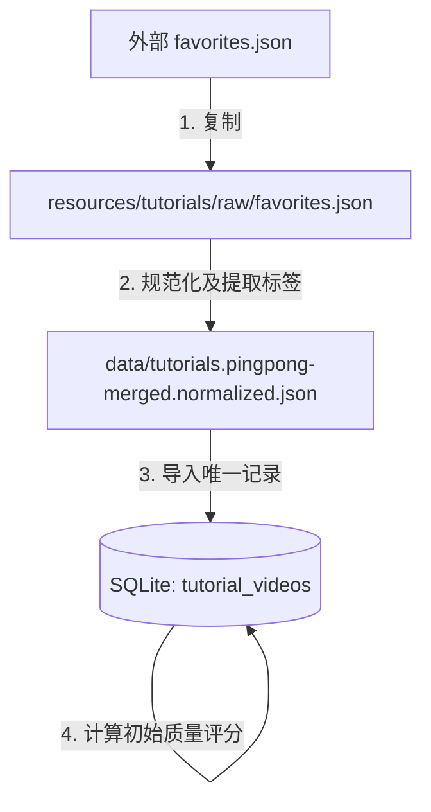

# Topstar Server Scripts

本目录包含视频教程库数据同步、规范化、导入及评分冷启动的工具脚本。

---

## 📂 脚本结构与职责

| 脚本文件名 | 职责描述 | 备注 |
| :--- | :--- | :--- |
| **`0_sync-tutorials.ts`** | **同步总调度入口**。负责创建备份、从外部拉取数据、调用规范化、执行数据导入及启动评分冷启动。 | 手动或 Cron 自动同步时优先运行此脚本 |
| **`normalize_pingpong_merged_tutorials.js`** | **数据规范化**。将外部的 raw favorites.json 转换为结构统一、提取出动作标签的规范化教程 JSON 文件。 | 由 `0_sync-tutorials.ts` 内部调用 |
| **`importTutorials.ts`** | **数据导入**。读取规范化后的 JSON 教程文件，将其以事务方式写入 SQLite `tutorial_videos` 数据表。 | 由 `0_sync-tutorials.ts` 内部调用 |
| **`bootstrapQualityScores.ts`** | **评分冷启动计算**。为新导入（评分为 0）的记录基于动作匹配度、收藏频次、信息完整度等规则计算并写入初始 `quality_score`。 | 由 `0_sync-tutorials.ts` 内部调用，也可单独运行 |

---

## 🔄 数据流与工作原理



### 1. 同步与备份逻辑
执行同步时，系统会自动在项目根目录的 `backups/tutorials/<时间戳>/` 下为以下内容创建备份，以便出错时能够快速回滚：
* 备份原始文件：`favorites.json.bak`
* 备份本地数据库：`topstar.db.bak`
* 备份规范化数据：`normalized.json.bak`

### 2. 标签提取规则
在规范化（`normalize_pingpong`）阶段，脚本会自动执行：
* 提取收藏夹名称中的技术方向（如：`乒乓_反手拧拉` $\rightarrow$ `反手`, `反手拧拉`）
* 根据文本内容匹配动作库标识（如出现 `正手拉下旋` $\rightarrow$ 关联 `fh_loop` 动作）
* 根据规则生成并清理相关的视频 Tags。

---

## 🚀 如何使用

在 `server` 目录下，您可以使用配置好的 npm 快捷脚本：

### 一键同步所有数据（推荐）
同步最新的外部教程，完成规范化、数据库入库以及自动计算推荐评分：
```bash
npm run sync-tutorials
```
> **对应命令**：`tsx scripts/0_sync-tutorials.ts`

---

### 其他辅助命令

#### 单独重新计算冷启动评分
如果您修改了评分规则（[bootstrapQualityScores.ts](file:///Users/yingdongma/Documents/Dev/projects/Topstar/server/scripts/bootstrapQualityScores.ts) 中的权值算法），可以手动执行此脚本重新扫描评分：
```bash
npm run bootstrap-scores
```
> **对应命令**：`tsx scripts/bootstrapQualityScores.ts`

#### 单独导入规范化数据
仅导入已被规范化过的 `tutorials.pingpong-merged.normalized.json`：
```bash
npm run import-tutorials
```
> **对应命令**：`tsx scripts/importTutorials.ts`
